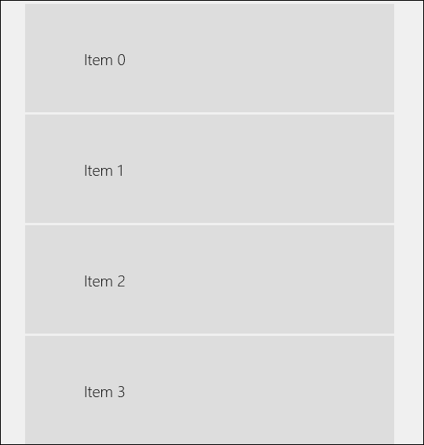

# SlidableListItem XAML Control

The **SlideableListItem Control** is a UI control that enables actions to be triggered by sliding the content left or right. This effect can be forced to ignore the mouse if only touch screen interaction is desired.

This control can be used as a ListView Data Template root to create effects similar to those common in mobile email apps like Outlook.

The **LeftCommand** and the **LeftCommandRequested** event is executed when the control has been swiped to the right, and **RightCommand** and the **RightCommandRequested** event is executed when the control has been swiped to the left. If you need more detailed control you can subscribe to the **SwipeStatusChanged** event. This is triggered when swiping starts, stops, swiping below and above **ActivationWidth** and some other cases. The following code shows how to detect some important events:

```csharp

    private void SlidableListItem_SwipeStatusChanged(SlidableListItem sender, SwipeStatusChangedEventArgs args)
    {
        if (args.NewValue == SwipeStatus.Starting)
        {
            // Swiping starting
        }
        else if (args.NewValue == SwipeStatus.Idle)
        {
            if (args.OldValue == SwipeStatus.SwipingPassedLeftThreshold)
            {
                // Swiping to the left completed
            }
            else if (args.OldValue == SwipeStatus.SwipingPassedRightThreshold)
            {
                // Swiping to the right completed
            }
            else
            {
                // Swiping cancelled
            }
        }
    }

```

If you use **SlidableListItem** in a **ListView** with the **ItemClick** event, you need to be aware the **ItemClick** event is triggered by default when the control has been swiped. If you don’t want this behavior you can set **IsPointerReleasedOnSwipingHandled** to **true** to suppress the **ItemClick** event. If you need more control you can instead check the **SwipeStatus** property in the **ItemClick** event. The following code shows how to do that:

```csharp

    private void ListView_ItemClick(object sender, ItemClickEventArgs e)
    {
        var listView = sender as ListView;
        var listViewItem = listView.ContainerFromItem(e.ClickedItem) as ListViewItem;
        var slidableListItem = listViewItem.ContentTemplateRoot as SlidableListItem;

        // Don't do anything unless the SwipeStatus is Idle.
        if (slidableListItem.SwipeStatus != SwipeStatus.Idle)
            return;

        ...
    }

```

## Syntax

```xml

<controls:SlidableListItem
	LeftIcon="Favorite" 
	RightIcon="Delete" 
	LeftLabel="Set Favorite" 
	RightLabel="Delete"
	LeftBackground="Green" 
	RightBackground="Red"
	LeftForeground="White" 
	RightForeground="Black"
	ActivationWidth="100"
	MouseSlidingEnabled="True"
	LeftCommand="ToggleFavorite"
	RightCommandRequested="SlidableListItem_RightCommandActivated">
	
	<StackPanel Column="1" Margin="10">
		<CheckBox IsChecked="False"></CheckBox>
		<TextBlock Text="My Great Text" TextWrapping="NoWrap"/>            
	</StackPanel>
</controls:SlidableListItem> 

```

## Example Image



## Example Code

[SlidableListItem Sample Page](https://github.com/Microsoft/UWPCommunityToolkit/tree/master/Microsoft.Toolkit.Uwp.SampleApp/SamplePages/SlidableListItem)

## Default Template 

[SlidableListItem XAML File](https://github.com/Microsoft/UWPCommunityToolkit/blob/master/Microsoft.Toolkit.Uwp.UI.Controls/SlidableListItem/SlidableListItem.xaml) is the XAML template used in the toolkit for the default styling.

## Requirements (Windows 10 Device Family)

| [Device family](http://go.microsoft.com/fwlink/p/?LinkID=526370) | Universal, 10.0.14393.0 or higher |
| --- | --- |
| Namespace | Microsoft.Toolkit.Uwp.UI.Controls |

## API

* [SlidableListItem source code](https://github.com/Microsoft/UWPCommunityToolkit/tree/master/Microsoft.Toolkit.Uwp.UI.Controls/SlidableListItem)

