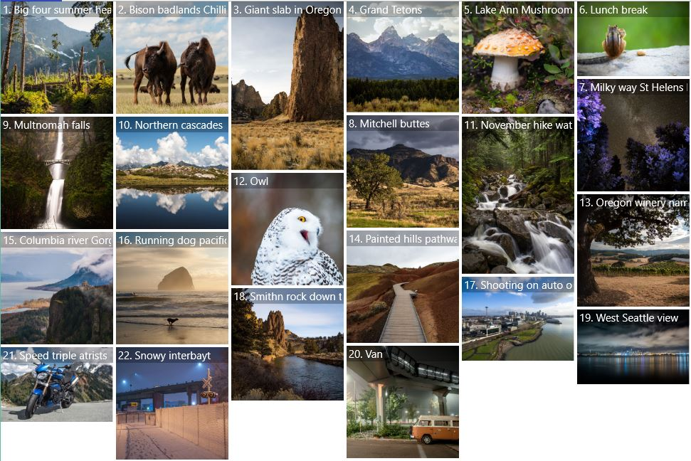

# StaggeredPanel
The [StaggeredPanel](https://docs.microsoft.com/en-us/dotnet/api/microsoft.toolkit.uwp.ui.controls.staggeredpanel) allows for layout of items in a column approach where an item will be added to whichever column has used the least amount of space.

## Syntax

**XAML**

```xaml
<ItemsControl>
    <ItemsControl.ItemTemplate>
        <DataTemplate>
            <Image Source="{Binding Thumbnail}"/>
        </DataTemplate>
    </ItemsControl.ItemTemplate>
    <ItemsControl.ItemsPanel>
        <ItemsPanelTemplate>
            <controls:StaggeredPanel/>
        </ItemsPanelTemplate>
    </ItemsControl.ItemsPanel>
</ItemsControl>
```

## Sample Output



## Properties

| Property | Type | Description |
| -- | -- | -- |
| DesiredColumnWidth | double | The desired width of each column. The width of columns can exceed the DesiredColumnWidth if the HorizontalAlignment is set to Stretch. |
| Padding | Thickness | The dimensions of the space between the edge and its child as a Thickness value. Thickness is a structure that stores dimension values using pixel measures. |

## Sample Code

[StaggeredPanel Sample Page](https://github.com/Microsoft/WindowsCommunityToolkit//tree/master/Microsoft.Toolkit.Uwp.SampleApp/SamplePages/StaggeredPanel). You can see this in action in the Windows Community Toolkit Sample App.

## Default Template

[StaggeredPanel XAML File](https://github.com/Microsoft/WindowsCommunityToolkit//blob/master/Microsoft.Toolkit.Uwp.UI.Controls/StaggeredPanel/StaggeredPanel.xaml) is the XAML template used in the toolkit for the default styling.

## Requirements

| [Device family](http://go.microsoft.com/fwlink/p/?LinkID=526370#device-families) | Universal, 10.0.15063.0 or higher   |
| -- | -- |
| Namespace | Microsoft.Toolkit.Uwp.UI.Controls |
| NuGet package | [Microsoft.Toolkit.Uwp.UI.Controls](https://www.nuget.org/packages/Microsoft.Toolkit.Uwp.UI.Controls/) |

## API Source Code

- [StaggeredPanel](https://github.com/Microsoft/WindowsCommunityToolkit//tree/master/Microsoft.Toolkit.Uwp.UI.Controls/StaggeredPanel)