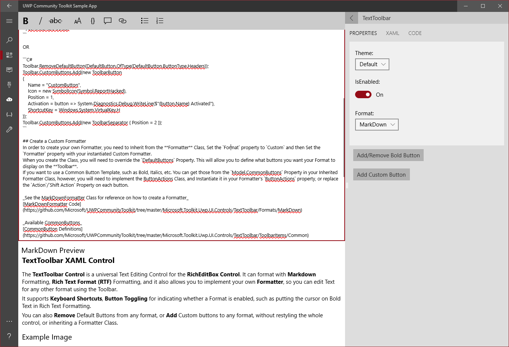

# TextToolbar XAML Control

The **TextToolbar Control** is a universal Text Editing Control for the **RichEditBox Control**. It can format with **Markdown** Formatting, **Rich Text Format (RTF)** Formatting, and it also allows you to implement your own **Formatter**, so you can edit Text for any other format using the Toolbar.
It supports **Keyboard Shortcuts**, **Button Toggling** for indicating whether a Format is enabled, such as putting the cursor on Bold Text in Rich Text Formatting.
You can also **Remove** Default Buttons from any format, or **Add** Custom buttons to any format, without restyling the whole control, or inheriting a Formatter Class.

## Example Image


## Example Code
[TextToolbar Sample Page](https://github.com/Microsoft/UWPCommunityToolkit/tree/master/Microsoft.Toolkit.Uwp.SampleApp/SamplePages/TextToolbar)

## Syntax
### UI Layout
```xml
<controls:TextToolbar x:Name="Toolbar" Editor="{x:Bind Editor}" Format="MarkDown" />
<RichEditBox x:Name="Editor" PlaceholderText="Enter Text Here" />
```
### How to Remove/Add Buttons
```xml
<controls:TextToolbar x:Name="Toolbar" Editor="{x:Bind Editor}">
    <controls:TextToolbar.ButtonModifications>
        <buttons:DefaultButton Type="Headers" IsVisible="False"/>
    </controls:TextToolbar.ButtonModifications>
    <controls:TextToolbar.CustomButtons>
        <buttons:ToolbarButton
            Name="CustomButton"
			Icon="ReportHacked"
            Position="1"
            Activation="{x:Bind System.Action<ToolbarButton>}"
            ShortcutKey="H" />
        <buttons:ToolbarSeparator Position="2" />
    </controls:TextToolbar.CustomButtons>
</controls:TextToolbar>
```

OR

```C#
var button = Toolbar.GetDefaultButton(ButtonType.Headers);
button.Visibility = Windows.UI.Xaml.Visibility.Collapsed;
Toolbar.CustomButtons.Add(new ToolbarButton
{
    Name = "CustomButton",
    Icon = new SymbolIcon(Symbol.ReportHacked),
    Position = 1,
    Activation = button => System.Diagnostics.Debug.WriteLine($"{button.Name} Activated"),
    ShortcutKey = Windows.System.VirtualKey.H
});
Toolbar.CustomButtons.Add(new ToolbarSeparator { Position = 2 });
```

## Create a Custom Formatter
In order to create your own Formatter, you need to Inherit from the **Formatter** Class. Then on the TextToolbar, Set the `Format` property to `Custom` and then Set the `Formatter` property with your instantiated Custom Formatter.

When you create the Class, you will need to override the `DefaultButtons` Property. This will allow you to define what buttons you want your Format to display on the **Toolbar**.

If you want to use a Common Button Template, such as Bold, Italics, etc. You can get those by Instantiating a `CommonButtons` Instance in your Formatter Class, however, you will need to implement the **ButtonActions** Class, and Instantiate it in your Formatter's `ButtonActions` property, or replace the `Action`/`Shift Action` Property on each button you use.

_See the MarkDownFormatter Class for reference on how to create a Formatter:_
[MarkDownFormatter Code](https://github.com/Microsoft/UWPCommunityToolkit/tree/master/Microsoft.Toolkit.Uwp.UI.Controls/TextToolbar/Formats/MarkDown)

_See the Sample Formatter Class from the Sample App:_
[SampleFormatter Code](https://github.com/Microsoft/UWPCommunityToolkit/tree/master/Microsoft.Toolkit.Uwp.SampleApp/SamplePages/TextToolbar/SampleFormatter.cs)

_Available CommonButtons:_
[CommonButton Definitions](https://github.com/Microsoft/UWPCommunityToolkit/tree/master/Microsoft.Toolkit.Uwp.UI.Controls/TextToolbar/ToolbarItems/Common)

## Requirements (Windows 10 Device Family)
| [Device family](http://go.microsoft.com/fwlink/p/?LinkID=526370) | Universal, 10.0.14393.0 or higher |
| --- | --- |
| Namespace | Microsoft.Toolkit.Uwp.UI.Controls |

## API
* [TextToolbar source code](https://github.com/Microsoft/UWPCommunityToolkit/tree/master/Microsoft.Toolkit.Uwp.UI.Controls/TextToolbar)