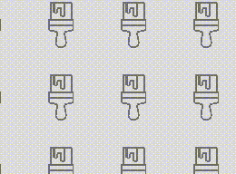

# TileControl XAML Control

The **Tile Control** is a control that repeats an image many times. It enables you to use animation and synchronization with a ScrollViewer to create parallax effect. XAML or Microsoft Composition are automatically used to render the control.

## Syntax

```xml

<controls:TileControl x:Name="Tile1"
	OffsetX="-10" 
	OffsetY="10"
	IsAnimated="True"
	ScrollViewerContainer="{x:Bind FlipView}"
	ParallaxSpeedRatio="1.2"
	/>

```

## Example Image



## Example Code

[TileControl Sample Page](https://github.com/Microsoft/UWPCommunityToolkit/tree/master/Microsoft.Toolkit.Uwp.SampleApp/SamplePages/TileControl)

## Default Template 

[TileControl XAML File](https://github.com/Microsoft/UWPCommunityToolkit/blob/master/Microsoft.Toolkit.Uwp.UI.Controls/TileControl/TileControl.xaml) is the XAML template used in the toolkit for the default styling.

## Requirements (Windows 10 Device Family)

| [Device family](http://go.microsoft.com/fwlink/p/?LinkID=526370) | Universal, 10.0.14393.0 or higher |
| --- | --- |
| Namespace | Microsoft.Toolkit.Uwp.UI.Controls |

## API

* [TileControl source code](https://github.com/Microsoft/UWPCommunityToolkit/tree/master/Microsoft.Toolkit.Uwp.UI.Controls/TileControl)