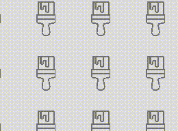

# TileControl XAML Control

The [Tile Control](https://docs.microsoft.com/dotnet/api/microsoft.toolkit.uwp.ui.controls.tilecontrol) is a control that repeats an image many times. It enables you to use animation and synchronization with a ScrollViewer to create parallax effect. XAML or Microsoft Composition are automatically used to render the control.

## Syntax

```xaml
<controls:TileControl x:Name="Tile1" OffsetX="-10" OffsetY="10" IsAnimated="True" 
	ScrollViewerContainer="{x:Bind FlipView}" ParallaxSpeedRatio="1.2"/>
```

## Sample Output



## Properties

| Property | Type | Description |
| -- | -- | -- |
| AnimationDuration | double | Gets or sets a duration for the animation of the tile |
| AnimationStepX | double | Gets or sets the animation step of the OffsetX |
| AnimationStepY | double | Gets or sets the animation step of the OffsetY |
| ImageAlignment | [ImageAlignment](https://docs.microsoft.com/dotnet/api/microsoft.toolkit.uwp.ui.controls.imagealignment) | Gets or sets the alignment of the tile when the `ScrollOrientation` is set to Vertical or Horizontal. Valid values are Left or Right for `ScrollOrientation` set to Horizontal and Top or Bottom for `ScrollOrientation` set to Vertical |
| ImageSource | Uri | Gets or sets the uri of the image to load |
| IsAnimated | bool | Gets or sets a value indicating whether the tile is animated or not |
| IsCompositionSupported | bool | Gets a value indicating whether the platform supports Composition |
| OffsetX | double | Gets or sets an X offset of the image |
| OffsetY | double | Gets or sets an Y offset of the image |
| ParallaxSpeedRatio | int | Gets or sets the speed ratio of the parallax effect with the `ScrollViewerContainer` |
| ScrollOrientation | [ScrollOrientation](https://docs.microsoft.com/dotnet/api/microsoft.toolkit.uwp.ui.controls.scrollorientation) | Gets or sets the scroll orientation of the tile. Less images are drawn when you choose the Horizontal or Vertical value |
| ScrollViewerContainer | FrameworkElement | Gets or sets a ScrollViewer or a frameworkElement containing a ScrollViewer. The tile control is synchronized with the offset of the scrollviewer |

## Events

| Events | Description |
| -- | -- |
| ImageLoaded | The image loaded event |

## Sample Code

[TileControl Sample Page Source](https://github.com/Microsoft/WindowsCommunityToolkit//tree/master/Microsoft.Toolkit.Uwp.SampleApp/SamplePages/TileControl). You can see this in action in [Windows Community Toolkit Sample App](https://www.microsoft.com/store/apps/9NBLGGH4TLCQ).

## Default Template 

[TileControl XAML File](https://github.com/Microsoft/WindowsCommunityToolkit//blob/master/Microsoft.Toolkit.Uwp.UI.Controls/TileControl/TileControl.xaml) is the XAML template used in the toolkit for the default styling.

## Requirements

| Device family | Universal, 10.0.15063.0 or higher |
| -- | -- |
| Namespace | Microsoft.Toolkit.Uwp.UI.Controls |
| NuGet package | [Microsoft.Toolkit.Uwp.UI.Controls](https://www.nuget.org/packages/Microsoft.Toolkit.Uwp.UI.Controls/) |

## API

* [TileControl source code](https://github.com/Microsoft/WindowsCommunityToolkit//tree/master/Microsoft.Toolkit.Uwp.UI.Controls/TileControl)