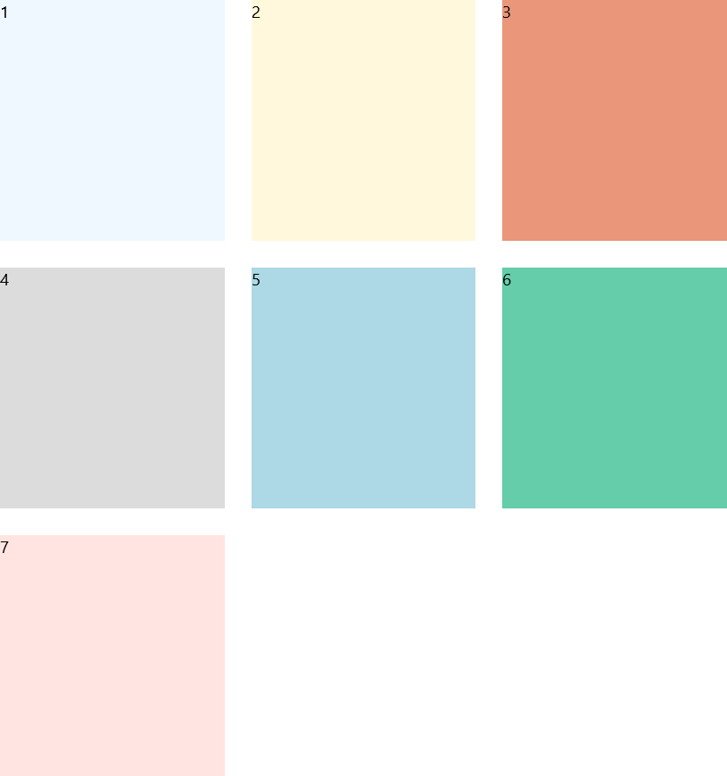
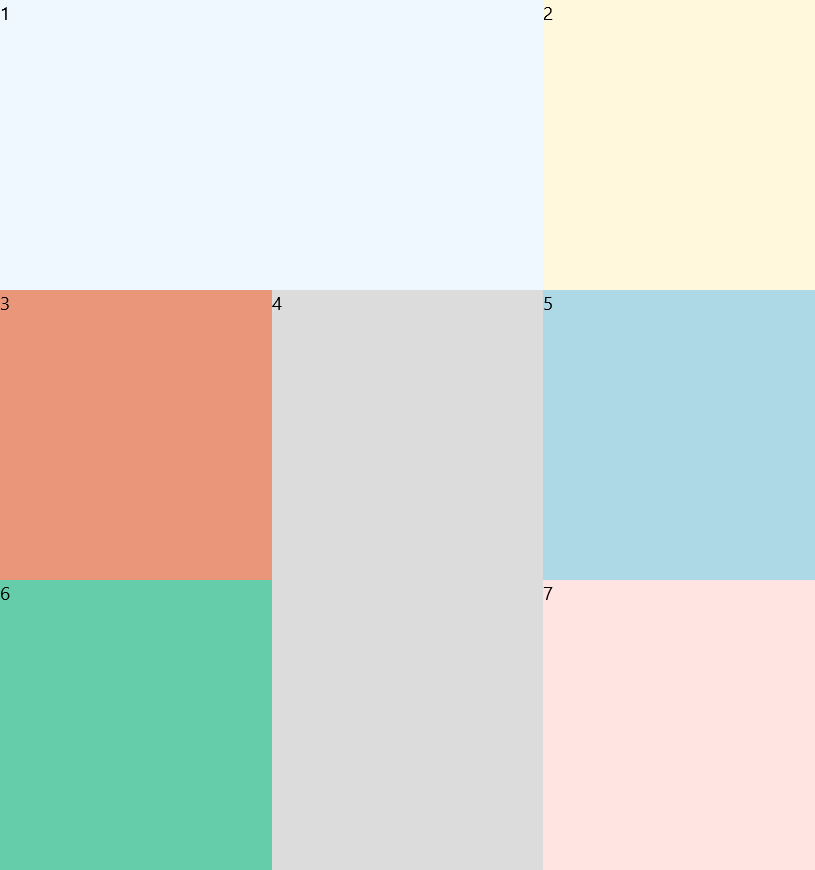
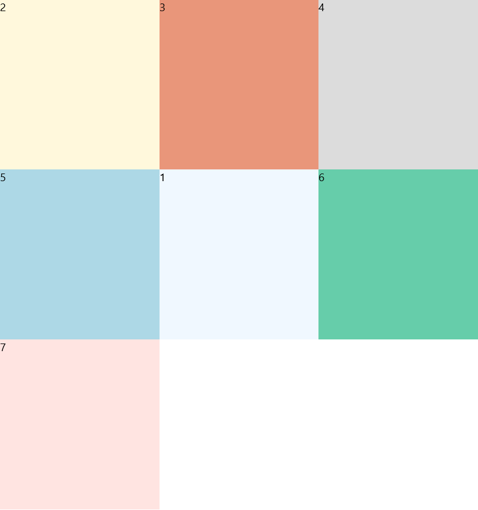
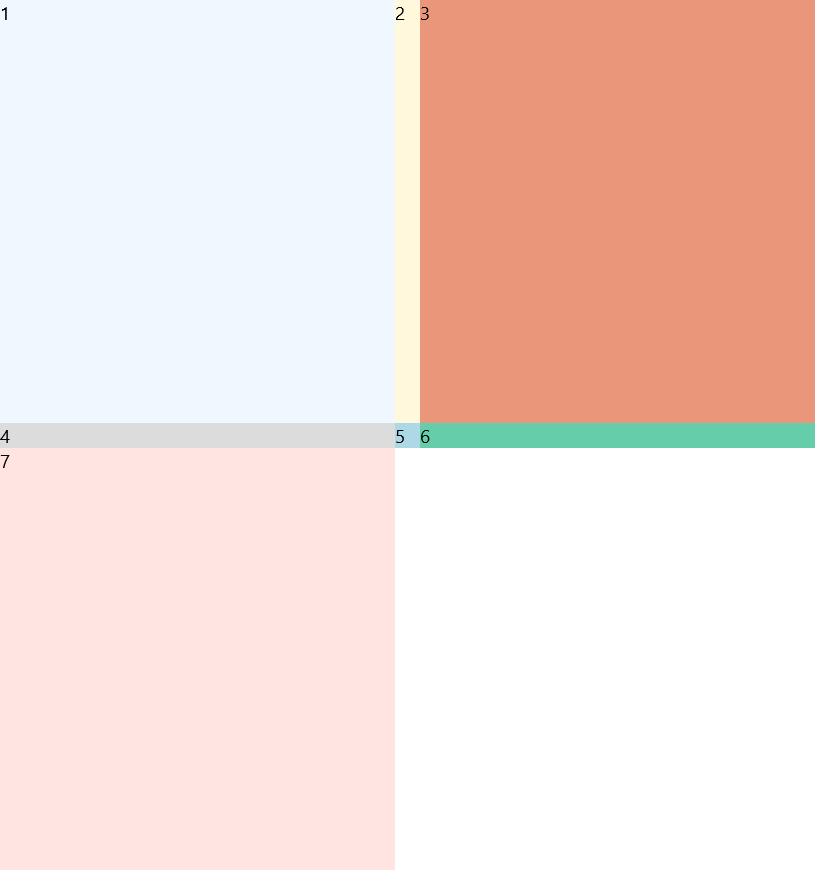
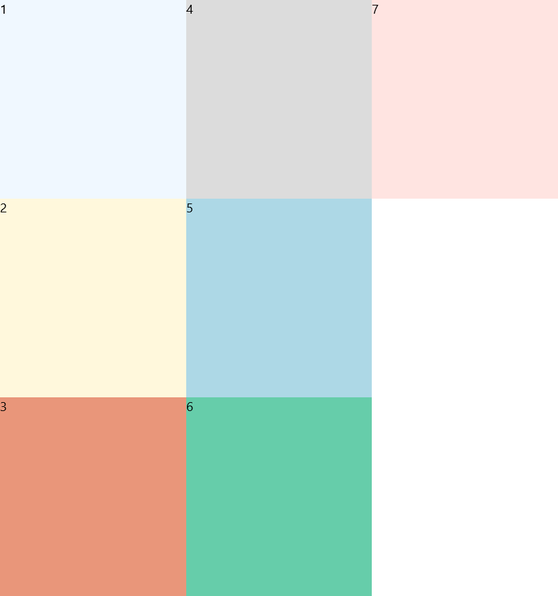

# UniformGrid XAML Control 

The **UniformGrid Control** is a responsive layout control which arranges items in a evenly-spaced set of rows or columns to fill the total available display space.  Each cell in the grid, by default, will be the same size.

If no value for `Rows` and `Columns` are provided, the UniformGrid will create a square layout based on the total number of visible items.

If a fixed size is provided for `Rows` and `Columns` then additional children that can't fit in the number of cells provided won't be displayed.

It differs from the [AdaptiveGridView](https://docs.microsoft.com/en-us/windows/uwpcommunitytoolkit/controls/adaptivegridview) which dictates 
its layout based on item sizes to where as the UniformGrid maintains the specified number of Rows and/or Columns.
In addition, UniformGrid is a `Panel` instead of an `ItemsControl`.  As such, it could be used as a Panel in such ItemsControls.

The UWP UniformGrid now inherits from [Grid](https://docs.microsoft.com/en-us/uwp/api/Windows.UI.Xaml.Controls.Grid) and provides many additional features compared to its predecessor, see more below.

## WPF Conversion Notes

When porting your UniformGrid XAML from WPF, just add the `controls:` namespace prefix to your `UniformGrid` and add the `xmlns:controls="using:Microsoft.Toolkit.Uwp.UI.Controls"` to your XAML namespace list.

See further notes below on the additional features the UWP UniformGrid provides compared to the WPF UniformGrid.  The behavior of `FirstColumn` has changed slightly, but only in cases where it was previously ignored in WPF.

## Syntax

```xaml

<controls:UniformGrid Margin="10" Rows="1"
        HorizontalAlignment="Right"
        VerticalAlignment="Bottom">
      <Button Grid.Column="0" Content="No" FontSize="18" Margin="5" Padding="6,3" HorizontalAlignment="Stretch" VerticalAlignment="Stretch"/>
      <Button Grid.Column="1" Content="Yes, Absolutely" Margin="5" Padding="6,3" HorizontalAlignment="Stretch" VerticalAlignment="Stretch"/>
      <Button Grid.Column="2" Content="Maybe" Margin="5" Padding="6,3" HorizontalAlignment="Stretch" VerticalAlignment="Stretch"/>
</controls:UniformGrid>

```

## Example Image

  

## Additional Features

### Grid Properties

UniformGrid supports the [RowSpacing](https://docs.microsoft.com/en-us/uwp/api/windows.ui.xaml.controls.grid.rowspacing) and [ColumnSpacing](https://docs.microsoft.com/en-us/uwp/api/windows.ui.xaml.controls.grid.columnspacing#Windows_UI_Xaml_Controls_Grid_ColumnSpacing) properties added in 16299, along with the previous Padding, Margin, and CornerRadius properties.

```
    <controls:UniformGrid ColumnSpacing="24" RowSpacing="24">
```

  

### Sized Children

If a child uses the `Grid.RowSpan` or `Grid.ColumnSpan` attached properties it can be enlarged and other children in the panel will skip over those cells when being laid out.  This can be combined with fixed items above.

```xaml
    <controls:UniformGrid>
      <Border Background="AliceBlue" Grid.ColumnSpan="2"><TextBlock Text="1"/></Border>
      <Border Background="Cornsilk"><TextBlock Text="2"/></Border>
      <Border Background="DarkSalmon"><TextBlock Text="3"/></Border>
      <Border Background="Gainsboro" Grid.RowSpan="2"><TextBlock Text="4"/></Border>
      <Border Background="LightBlue"><TextBlock Text="5"/></Border>
      <Border Background="MediumAquamarine"><TextBlock Text="6"/></Border>
      <Border Background="MistyRose"><TextBlock Text="7"/></Border>
    </controls:UniformGrid>
```

  

> [!NOTE]
If an item is laid out in a position such that it's size would make it too large for the current layout, it may be cropped to fit within the grid instead.  However, it's size is usually taken into account when determining how large the grid should be.
>
> E.g. if the UniformGrid's next available cell is the last cell of the row, but the child is requesting to have a ColumnSpan of 2, then the item will not wrap to the next line leaving a blank space or filling with a smaller item, but instead have it's ColumnSpan request ignored.

### Fixed Child Locations

If a child uses the `Grid.Row` or `Grid.Column` attached properties it will be fixed in place in the grid and other children in the panel will be laid out around it instead.  This can be combined with sized items below.

```xaml
    <controls:UniformGrid>
      <Border Background="AliceBlue" Grid.Row="1" Grid.Column="1"><TextBlock Text="1"/></Border>
      <Border Background="Cornsilk"><TextBlock Text="2"/></Border>
      <Border Background="DarkSalmon"><TextBlock Text="3"/></Border>
      <Border Background="Gainsboro"><TextBlock Text="4"/></Border>
      <Border Background="LightBlue"><TextBlock Text="5"/></Border>
      <Border Background="MediumAquamarine"><TextBlock Text="6"/></Border>
      <Border Background="MistyRose"><TextBlock Text="7"/></Border>
    </controls:UniformGrid>
```

  

> [!IMPORTANT]
Fixed locations must be provided before initial layout.  Otherwise, an element will be marked to always participate in automatic layout.

******

> [!NOTE]
In order to pin a child to the top-left position (0, 0), you must specify the `controls:UniformGrid.AutoLayout` property to be `False`.  *(This is the ONLY way the `AutoLayout` property should be used.)*  Otherwise, the UniformGrid can't distinguish between the default locations of Grid children (0, 0) and knowing that you don't want it to be automatically arranged during layout.
>
> E.g. ```<Border Background="Gainsboro" controls:UniformGrid.AutoLayout="{ex:NullableBool Value=False}"><TextBlock Text="4"/></Border>```
>
> This specific edge-case is only supported in Markup on 16299 and above for the required Markup Extension; otherwise, name the element and use code-behind to set the property.

### Override Rows and Columns

While the UniformGrid doesn't require the specification of `RowDefinitions` or `ColumnDefinitions`, you can override them in the UWP UniformGrid.  By specifying a set of definitions, you can change the layout sizes of items in the grid.  Any other columns or rows required by the layout will be added.

```xaml
    <controls:UniformGrid>
      <controls:UniformGrid.RowDefinitions>
        <RowDefinition/>
        <RowDefinition Height="20"/>
        <RowDefinition/>
      </controls:UniformGrid.RowDefinitions>
      <controls:UniformGrid.ColumnDefinitions>
        <ColumnDefinition/>
        <ColumnDefinition Width="20"/>
        <ColumnDefinition/>
      </controls:UniformGrid.ColumnDefinitions>
      <Border Background="AliceBlue"><TextBlock Text="1"/></Border>
      <Border Background="Cornsilk"><TextBlock Text="2"/></Border>
      <Border Background="DarkSalmon"><TextBlock Text="3"/></Border>
      <Border Background="Gainsboro"><TextBlock Text="4"/></Border>
      <Border Background="LightBlue"><TextBlock Text="5"/></Border>
      <Border Background="MediumAquamarine"><TextBlock Text="6"/></Border>
      <Border Background="MistyRose"><TextBlock Text="7"/></Border>
    </controls:UniformGrid>
```

  

### Orientation

In addition to `FlowDirection` to layout items from Right-to-Left.  The UWP UniformGrid supports `Orientation` as well to layout items from Top-to-Bottom.  These two properties can be combined to control layout flow.

```xaml
    <controls:UniformGrid Orientation="Vertical">
      <Border Background="AliceBlue"><TextBlock Text="1"/></Border>
      <Border Background="Cornsilk"><TextBlock Text="2"/></Border>
      <Border Background="DarkSalmon"><TextBlock Text="3"/></Border>
      <Border Background="Gainsboro"><TextBlock Text="4"/></Border>
      <Border Background="LightBlue"><TextBlock Text="5"/></Border>
      <Border Background="MediumAquamarine"><TextBlock Text="6"/></Border>
      <Border Background="MistyRose"><TextBlock Text="7"/></Border>
    </controls:UniformGrid>
```

  

> [!NOTE]
Changing the `FlowDirection` or `Orientation` properties effect how `FirstColumn` is interpreted.  `FlowDirection` will effectively mirror the layout on the vertical axis.  `Orientation` instead acts more like a transpose and will push items in the first column down.

## Properties

| Property | Type | Description |
| -- | -- | -- |
| Columns | int | Specifies a fixed number of columns to use for layout.  Defaults to `0` which will automatically calculate a value based on the number of items. |
| FirstColumn | int | Specifies the first column from the top-left (during normal layout) to display the first item.  Defaults to `0`.
| Orientation | Windows.UI.Xaml.Controls.Orientation | Determines if layout proceeds horizontally from left-to-right or vertically from top-to-bottom.  The default is `Horizontal`. |
| Rows | int | Specifies a fixed number of rows to use for layout.  Defaults to `0` which will automatically calculate a value based on the number of items. |

## Attached Properties

| Property | Type | Description |
| -- | -- | -- |
| AutoLayout | bool? | **DO NOT USE** - Internal property used to keep track of items that are fixed in position or need to automatically adjusted during layout. *Only set to `False` for the top-left edge case scenario described above for fixed child locations.* |

## Example Code

[UniformGrid Sample Page](https://github.com/Microsoft/WindowsCommunityToolkit//tree/master/Microsoft.Toolkit.Uwp.SampleApp/SamplePages/UniformGrid)

## Requirements (Windows 10 Device Family)

| [Device family](http://go.microsoft.com/fwlink/p/?LinkID=526370) | Universal, 10.0.15063.0 or higher |
| --- | --- |
| Namespace | Microsoft.Toolkit.Uwp.UI.Controls |
| NuGet package | [Microsoft.Toolkit.Uwp.UI.Controls](https://www.nuget.org/packages/Microsoft.Toolkit.Uwp.UI.Controls/) |

## API Source Code

- [UniformGrid source code](https://github.com/Microsoft/WindowsCommunityToolkit//tree/master/Microsoft.Toolkit.Uwp.UI.Controls/UniformGrid.cs)

## Related Topics

- [Grid Class](https://docs.microsoft.com/en-us/uwp/api/Windows.UI.Xaml.Controls.Grid)
- [Layouts with XAML](https://docs.microsoft.com/en-us/windows/uwp/design/layout/layouts-with-xaml)
- [System.Windows.Controls.Primitives.UniformGrid](https://msdn.microsoft.com/en-us/library/system.windows.controls.primitives.uniformgrid(v=vs.110).aspx)
- [NullableBool Markup Extension](../extensions/NullableBoolMarkup.md)
