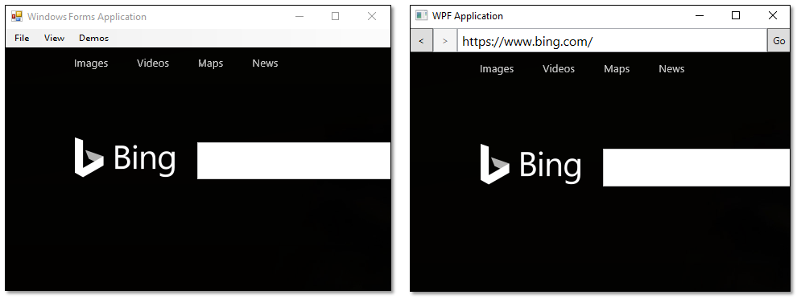

# WebView controls for Windows Forms and WPF applications

The **WebView** control shows web content in your Windows Forms or WPF desktop application.



This control uses the Microsoft Edge rendering engine to embed a view that renders richly formatted HTML content from a remote web server, dynamically generated code, or content files.

## About WebView controls

The Windows Forms version of this control is located in the **Microsoft.Toolkit.Win32.UI.Controls.WinForms** namespace. The WPF version is located in the **Microsoft.Toolkit.Win32.UI.Controls.WPF** namespace. You can find additional related types (such as event args classes) in the **Microsoft.Toolkit.Win32.UI.Controls.Interop.WinRT** namespace.

Internally, these controls wrap the [WebViewControl](https://docs.microsoft.com/uwp/api/windows.web.ui.interop.webviewcontrol) class, so they provide a subset of members from that class. The [WebViewControl](https://docs.microsoft.com/uwp/api/windows.web.ui.interop.webviewcontrol) is similar to the [WebView](https://docs.microsoft.com/uwp/api/windows.ui.xaml.controls.webview) class, but it is designed to run out of process in a desktop application (such as a WPF or Windows Forms application) and it supports a smaller set of members.

Unless specified otherwise in this article, the documentation for the [WebViewControl](https://docs.microsoft.com/uwp/api/windows.web.ui.interop.webviewcontrol) class applies to the WPF and Windows Forms **WebView** controls. This article links to reference pages for the UWP [WebViewControl](https://docs.microsoft.com/uwp/api/windows.web.ui.interop.webviewcontrol) class for more information about most members.

## Prerequisites

:heavy_check_mark: Visual Studio 2017.

:heavy_check_mark: Windows 10 Insider Preview Build 17110 or a later release.

:heavy_check_mark: .NET Framework 4.6.2 or a later release.

:heavy_check_mark: Configure your application for high DPI support. To learn how, see [this section](#high-dpi) of the guide.

## Feature limitations

When compared to the UWP **WebView** control, the current release of the WPF and Windows Forms **WebView** control has some limitations. For the complete list of these limitations, see [Known Issues of the WebView control for Windows Forms and WPF applications](WebView-known-issues.md).

## Add the WebView control to the Visual Studio Toolbox

First, open the Visual Studio **Toolbox**, then right-click anywhere in the toolbox, and select the **Choose Items** option.

<!-- Remove these steps before going public. This is for early adopters only -->

### For Windows Forms applications

1. In the **.NET Framework Components** tab of the **Choose Toolbox Items** dialog box.

2. Use the **Browse** button to locate the **Microsoft.Toolkit.Win32.UI.Controls.dll** in your NuGet package folder.

   For help finding that folder, see [Managing the global packages, cache, and temp folders](https://docs.microsoft.com/nuget/consume-packages/managing-the-global-packages-and-cache-folders).

3. Add that file to the list of Toolbox controls, and then close the **Choose Toolbox Items** dialog box.

   The **WebView** control appears in the **All Windows Forms** section of the **Toolbox**.

   In **Solution Explorer**, the **Microsoft.Toolkit.Win32.UI.Controls.dll** file appears in the **References** list.

### For WPF applications

The **WebView** control appears in the **Windows Community Toolkit** section of the **Toolbox** in Visual Studio or Blend and you can drag it directly the designer. You can also create an instance of the **WebView** control in code, but we recommend that you do not add **WebView** controls to popup windows because support for that scenario will soon be disabled for security reasons.

<a id="high-dpi" />

## Enable the WebView control to appear properly on high DPI displays

If users open your application on displays that have a high Dots Per Inch (DPI) displays, your WebView won't appear at the proper scale unless you configure your application first.

### Configure a Windows Forms application

For guidance, see [Configuring your Windows Forms app for high DPI support](https://docs.microsoft.com/dotnet/framework/winforms/high-dpi-support-in-windows-forms#configuring-your-windows-forms-app-for-high-dpi-support).

### Configure a WPF application

Add the following XML to your application manifest file:

```XML
<compatibility xmlns="urn:schemas-microsoft-com:compatibility.v1">
    <application>
      <!-- Windows 10 -->
      <supportedOS Id="{8e0f7a12-bfb3-4fe8-b9a5-48fd50a15a9a}" />
    </application>
  </compatibility>
```
Add the following XML to your application configuration file:

```XML
<application xmlns="urn:schemas-microsoft-com:asm.v3">
   <windowsSettings>
     <!-- The combination of below two tags have the following effect :
     1) Per-Monitor for >= Windows 10 Anniversary Update
     2) System < Windows 10 Anniversary Update -->
     <dpiAwareness xmlns="http://schemas.microsoft.com/SMI/2016/WindowsSettings">PerMonitor</dpiAwareness>
     <dpiAware xmlns="http://schemas.microsoft.com/SMI/2005/WindowsSettings">true/PM</dpiAware>
   </windowsSettings>
 </application>
```

## Modify the appearance of a WebView

To constrain the display area, set the `Width` and `Height` properties.

This table contains links to each of these members.

| Member | Windows Forms WebView | WPF WebView |
|-------|-------------|---|
|Width property |[Width](https://docs.microsoft.com/dotnet/api/system.windows.forms.control.width)|[Width](https://docs.microsoft.com/dotnet/api/system.windows.frameworkelement.width)|
|Height property|[Height](https://docs.microsoft.com/dotnet/api/system.windows.forms.control.height)|[Height](https://docs.microsoft.com/dotnet/api/system.windows.frameworkelement.height)|

## Get the web page title

You can get the title of the HTML document currently displayed in the **WebView** by using the [DocumentTitle](https://docs.microsoft.com/uwp/api/windows.web.ui.interop.webviewcontrol.documenttitle) property.

## Input events and tab order

You can use the [InvokeScriptAsync](https://docs.microsoft.com/uwp/api/windows.web.ui.interop.webviewcontrol.invokescriptasync) method with the JavaScript **eval** function to use the HTML event handlers, and use **window.external.notify** from the HTML event handlers to notify the application using the [ScriptNotify](https://docs.microsoft.com/uwp/api/windows.web.ui.interop.webviewcontrol.scriptnotify) event.

## Navigate to content

The **WebView** control has several APIs for basic navigation:  [GoBack](https://docs.microsoft.com/uwp/api/windows.web.ui.interop.webviewcontrol.goback), [GoForward](https://docs.microsoft.com/uwp/api/windows.web.ui.interop.webviewcontrol.goforward), [Stop](https://docs.microsoft.com/uwp/api/windows.web.ui.interop.webviewcontrol.stop), [Refresh](https://docs.microsoft.com/uwp/api/windows.web.ui.interop.webviewcontrol.refresh), [CanGoBack](https://docs.microsoft.com/uwp/api/windows.web.ui.interop.webviewcontrol.cangoback), and [CanGoForward](https://docs.microsoft.com/uwp/api/windows.web.ui.interop.webviewcontrol.cangoforward). You can use these to add typical web browsing capabilities to your app.

To set the initial content of the the **WebView** control, you can set the [Source](https://docs.microsoft.com/uwp/api/windows.web.ui.interop.webviewcontrol.source) property in code, XAML, or in the **Properties** window. You can also use the **Navigate** methods to load content in code. Here's an example.

```csharp
webView1.Navigate("http://www.contoso.com");
```

## Respond to navigation events

The **WebView** control provides several events that you can use to respond to navigation and content loading states. The events occur in the following order for the root web view content:

1. [NavigationStarting](https://docs.microsoft.com/uwp/api/windows.web.ui.interop.webviewcontrol.navigationstarting)

2. [ContentLoading](https://docs.microsoft.com/uwp/api/windows.web.ui.interop.webviewcontrol.contentloading)

3. [DOMContentLoaded](https://docs.microsoft.com/uwp/api/windows.web.ui.interop.webviewcontrol.domcontentloaded)

4. [NavigationCompleted](https://docs.microsoft.com/uwp/api/windows.web.ui.interop.webviewcontrol.navigationcompleted)

The **NavigationStarting** event is raised before the web view navigates to new content. You can cancel navigation in a handler for this event by setting the ``WebViewNavigationStartingEventArgs.Cancel`` property to true.

```csharp
webView1.NavigationStarting += webView1_NavigationStarting;

private void webView1_NavigationStarting(object sender, WebViewNavigationStartingEventArgs args)
{
    // Cancel navigation if URL is not allowed. (Implemetation of IsAllowedUri not shown.)
    if (!IsAllowedUri(args.Uri))
        args.Cancel = true;
}
```

The **ContentLoading** is raised when the web view has started loading new content.

```csharp
webView1.ContentLoading += webView1_ContentLoading;

private void webView1_ContentLoading(WebView sender, WebViewContentLoadingEventArgs args)
{
    // Show status.
    if (args.Uri != null)
    {
        statusTextBlock.Text = "Loading content for " + args.Uri.ToString();
    }
}
```

The **DOMContentLoaded** event is raised when the web view has finished parsing the current HTML content.

```csharp
webView1.DOMContentLoaded += webView1_DOMContentLoaded;

private void webView1_DOMContentLoaded(WebView sender, WebViewDOMContentLoadedEventArgs args)
{
    // Show status.
    if (args.Uri != null)
    {
        statusTextBlock.Text = "Content for " + args.Uri.ToString() + " has finished loading";
    }
}
```

The **NavigationCompleted** event is raised when the web view has finished loading the current content or if navigation has failed. To determine whether navigation has failed, check the **IsSuccess** and **WebErrorStatus** properties of the event args.

```csharp
webView1.NavigationCompleted += webView1_NavigationCompleted;

private void webView1_NavigationCompleted(WebView sender, WebViewNavigationCompletedEventArgs args)
{
    if (args.IsSuccess == true)
    {
        statusTextBlock.Text = "Navigation to " + args.Uri.ToString() + " completed successfully.";
    }
    else
    {
        statusTextBlock.Text = "Navigation to: " + args.Uri.ToString() +
                               " failed with error " + args.WebErrorStatus.ToString();
    }
}
```

Similar events occur in the same order for each **iframe** in the web view content:

1. The [FrameNavigationStarting](https://docs.microsoft.com/uwp/api/windows.web.ui.interop.webviewcontrol.framenavigationstarting) event is raised before a frame in the web view navigates to new content.

2. The [FrameContentLoading](https://docs.microsoft.com/uwp/api/windows.web.ui.interop.webviewcontrol.framecontentloading) event is raised when a frame in the web view has started loading new content.

3. The [FrameDOMContentLoaded](https://docs.microsoft.com/uwp/api/windows.web.ui.interop.webviewcontrol.framedomcontentloaded) event is raised when a frame in the web view has finished parsing its current HTML content.

4. The [FrameNavigationCompleted](https://docs.microsoft.com/uwp/api/windows.web.ui.interop.webviewcontrol.framenavigationcompleted) event is raised when a frame in the web view has finished loading its content.

## Respond to potential problems

You can respond to potential problems with the content such as long running scripts, content that the **WebView** control can't load, and warnings of unsafe content.

Your app might appear unresponsive while scripts are running. The [LongRunningScriptDetected](https://docs.microsoft.com/uwp/api/windows.web.ui.interop.webviewcontrol.longrunningscriptdetected) event is raised periodically while the web view executes JavaScript. This provides you with an opportunity to interrupt the script. To determine how long the script has been running, check the [ExecutionTime](https://docs.microsoft.com/uwp/api/windows.web.ui.webviewcontrollongrunningscriptdetectedeventargs.executiontime) property of the [WebViewControlLongRunningScriptDetectedEventArgs](https://docs.microsoft.com/uwp/api/windows.web.ui.webviewcontrollongrunningscriptdetectedeventargs). To halt the script, set the event args [StopPageScriptExecution](https://docs.microsoft.com/uwp/api/windows.web.ui.webviewcontrollongrunningscriptdetectedeventargs.stoppagescriptexecution) property to **true**. The halted script will not execute again unless it is reloaded during a subsequent web view navigation.
<!-- Not able to get the event to fire without causing the application to go unresponsive -->

The web view control cannot host arbitrary file types. When an attempt is made to load content that the web view can't host, the [UnviewableContentIdentified](https://docs.microsoft.com/uwp/api/windows.web.ui.interop.webviewcontrol.unviewablecontentidentified) event occurs. You can handle this event and notify the user.

Similarly, the [UnsupportedUriSchemeIdentified](https://docs.microsoft.com/uwp/api/windows.web.ui.interop.webviewcontrol.unsupportedurischemeidentified) event occurs when a URI scheme that's not supported is invoked in the web content, such as fbconnect:// or mailto://. You can handle this event to provide custom behavior instead of allowing the default system launcher to launch the URI.

The [UnsafeContentWarningDisplayingEvent](https://docs.microsoft.com/uwp/api/windows.web.ui.interop.webviewcontrol.unsafecontentwarningdisplaying) event occurs when the web view shows a warning page for content that was reported as unsafe by the SmartScreen Filter. If the user chooses to continue the navigation, subsequent navigation to the page will not display the warning nor fire the event.

## Handle special cases for web view content

You can use the [ContainsFullScreenElement](https://docs.microsoft.com/uwp/api/windows.web.ui.interop.webviewcontrol.containsfullscreenelement) property and [ContainsFullScreenElementChanged](https://docs.microsoft.com/uwp/api/windows.web.ui.interop.webviewcontrol.containsfullscreenelementchanged) event to detect, respond to, and enable full-screen experiences in web content, such as full-screen video playback.

For example, you might use the **ContainsFullScreenElementChanged** event to resize the web view to occupy the entire app view, or, as the following example illustrates, put a windowed app in full screen mode.

```csharp
// Assume webView is defined in XAML
webView.ContainsFullScreenElementChanged += webView_ContainsFullScreenElementChanged;

private void webView_ContainsFullScreenElementChanged(object sender, object args)
{
    var webview = sender as WebView;
    var applicationView = ApplicationView.GetForCurrentView();

    if (webview.ContainsFullScreenElement)
    {
        applicationView.TryEnterFullScreenMode();
    }
    else if (applicationView.IsFullScreenMode)
    {
        applicationView.ExitFullScreenMode();
    }
}
```

You can use the [NewWindowRequested](https://docs.microsoft.com/uwp/api/windows.web.ui.interop.webviewcontrol.newwindowrequested) event to handle cases where hosted web content requests a new window, such as a popup window. You can use another **WebView** control to display the contents of the requested window.
<!-- Cannot get this event to fire -->

Handle the [PermissionRequested](https://docs.microsoft.com/uwp/api/windows.web.ui.interop.webviewcontrol.permissionrequested) event to enable web features that require special capabilities. These currently include geolocation, IndexedDB storage, and user audio and video (for example, from a microphone or webcam).

<!-- This behaves differently than UWP: The sandbox process Win32WebViewHost.exe is a system application and has all capabilities listed in its manifest. Since WinForms/WPF do not have their own identities, they use the identity and permissions of the sandbox application.
The PermissionRequested event is fired when a permission is reqested each time. If the application is the first to request permissions from the sandbox, the user will receive two prompts: one from the application, one from the system for the sandbox. -->

In addition to the app handling the [PermissionRequested](https://docs.microsoft.com/uwp/api/windows.web.ui.interop.webviewcontrol.permissionrequested) event, the user will have to approve standard system dialogs for apps requesting location or media capabilities in order for these features to be enabled.

Here is an example of how an app would enable geolocation in a map from Bing:

```csharp
// Assume webView is defined in XAML
webView.PermissionRequested += webView_PermissionRequested;

private void webView_PermissionRequested(WebView sender, WebViewPermissionRequestedEventArgs args)
{
    if (args.PermissionRequest.PermissionType == WebViewPermissionType.Geolocation &&
        args.PermissionRequest.Uri.Host == "www.bing.com")
    {
        args.PermissionRequest.Allow();
    }
}
```

If your app requires user input or other asynchronous operations to respond to a permission request, use the [Defer](https://docs.microsoft.com/uwp/api/windows.web.ui.webviewcontrolpermissionrequest.defer) method of [WebViewControlPermissionRequest](https://docs.microsoft.com/uwp/api/windows.web.ui.webviewcontrolpermissionrequest) to create a [WebViewControlDeferredPermissionRequest](https://docs.microsoft.com/uwp/api/windows.web.ui.webviewdeferredpermissionrequest) that can be acted upon at a later time.

## Interact with web view content

You can interact with the content of the web view by using the [InvokeScriptAsync](https://docs.microsoft.com/uwp/api/windows.web.ui.interop.webviewcontrol.invokescriptasync) method to invoke or inject script into the web view content, and the [ScriptNotify](https://docs.microsoft.com/uwp/api/windows.web.ui.interop.webviewcontrol.scriptnotify) event to get information back from the web view content.

To invoke JavaScript inside the web view content, use the [InvokeScriptAsync](https://docs.microsoft.com/uwp/api/windows.web.ui.interop.webviewcontrol.invokescriptasync) method. The invoked script can return only string values.

For example, if the content of a web view named `webView1` contains a function named `setDate` that takes 3 parameters, you can invoke it like this.

```csharp
string[] args = {"January", "1", "2000"};
string returnValue = await webView1.InvokeScriptAsync("setDate", args);
```

You can use **InvokeScriptAsync** with the JavaScript **eval** function to inject content into the web page.

Here, the text of a XAML text box (`nameTextBox.Text`) is written to a div in an HTML page hosted in `webView1`.

```csharp
private async void Button_Click(object sender, RoutedEventArgs e)
{
    string functionString = String.Format("document.getElementById('nameDiv').innerText = 'Hello, {0}';", nameTextBox.Text);
    await webView1.InvokeScriptAsync("eval", new string[] { functionString });
}
```

Scripts in the web view content can use **window.external.notify** with a string parameter to send information back to your app. To receive these messages, handle the [ScriptNotify](https://docs.microsoft.com/uwp/api/windows.web.ui.interop.webviewcontrol.scriptnotify) event.

## Options for web content hosting

You can use the [Settings](https://docs.microsoft.com/uwp/api/windows.web.ui.interop.webviewcontrol.settings) property (of type [WebViewControlSettings](https://docs.microsoft.com/uwp/api/windows.web.ui.interop.webviewcontrolsettings) to control whether JavaScript and IndexedDB are enabled. For example, if you use a web view to display strictly static content, you might want to disable JavaScript for best performance.

## Requirements

| Device family | .NET 4.6.2, Windows 10 (introduced v10.0.17110.0) |
| -- | -- |
| Namespace | Microsoft.Toolkit.Win32.UI.Controls.WinForms, Microsoft.Toolkit.Win32.UI.Controls.WPF |
| NuGet package | [Microsoft.Toolkit.Win32.UI.Controls](https://www.nuget.org/packages/Microsoft.Toolkit.Win32.UI.Controls/) |

## API Source Code

- [WinForms.WebView](https://github.com/Microsoft/WindowsCommunityToolkit/tree/master/Microsoft.Toolkit.Win32/Microsoft.Toolkit.Win32.UI.Controls/WinForms/WebView)
- [WPF.WebView](https://github.com/Microsoft/WindowsCommunityToolkit/tree/master/Microsoft.Toolkit.Win32/Microsoft.Toolkit.Win32.UI.Controls/WPF/WebView)
