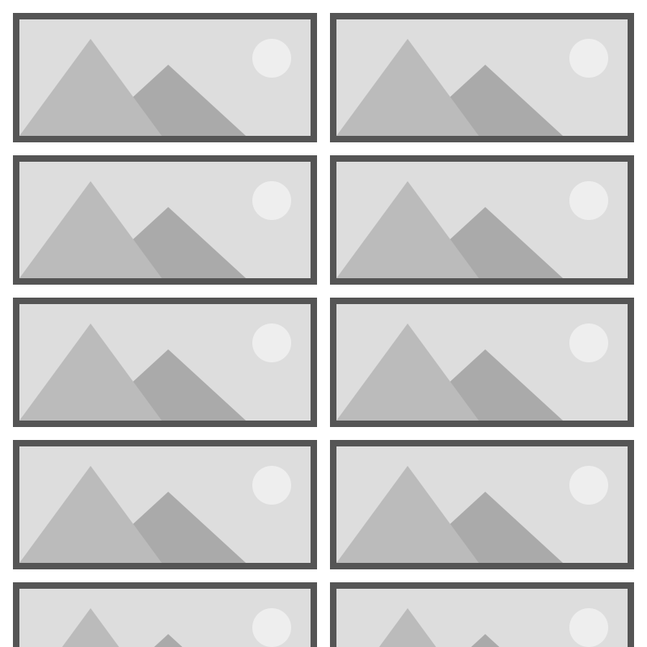

# WrapPanel XAML Control

The **WrapPanel Control** Positions child elements in sequential position from left to right, breaking content to the next line at the edge of the containing box. Subsequent ordering happens sequentially from top to bottom or from right to left, depending on the value of the Orientation property.

### How it works

The WrapPanel position child controls based on orientation, horizontal orientation (default) positions controls from left to right and vertical orientation positions controls from top to bottom, and once the max width or height is reached the control automatically create row or column based on the orientation. 

## Syntax

```xml

<wrapPanel:WrapPanel Name="VerticalWrapPanel"
                                 Grid.Row="1"
                                 Margin="2"
                                 Orientation="Vertical" />

```


## Example Image



## Example Code

[WrapPanel Sample Page](https://github.com/Microsoft/UWPCommunityToolkit/tree/master/Microsoft.Toolkit.Uwp.SampleApp/SamplePages/WrapPanel)

The following sample demonstrates how to add WrapPanel Control.

```xml

<Page x:Class="Microsoft.Toolkit.Uwp.SampleApp.SamplePages.WrapPanelPage"
      xmlns="http://schemas.microsoft.com/winfx/2006/xaml/presentation"
      xmlns:x="http://schemas.microsoft.com/winfx/2006/xaml"
      xmlns:d="http://schemas.microsoft.com/expression/blend/2008"
      xmlns:local="using:Microsoft.Toolkit.Uwp.SampleApp.SamplePages"
      xmlns:mc="http://schemas.openxmlformats.org/markup-compatibility/2006"
      xmlns:wrapPanel="using:Microsoft.Toolkit.Uwp.UI.Controls.WrapPanel"
      mc:Ignorable="d">

    <Grid Background="{StaticResource Brush-Grey-05}">
        <Grid.RowDefinitions>
            <RowDefinition />
            <RowDefinition />
        </Grid.RowDefinitions>
        <Grid>
            <Grid.RowDefinitions>
                <RowDefinition Height="50" />
                <RowDefinition />
            </Grid.RowDefinitions>
            <Button Name="HorizontalButton"
                    Click="HorizontalButton_Click"
                    Content="Add Horizontal Control" />
            <wrapPanel:WrapPanel Name="HorizontalWrapPanel"
                                 Grid.Row="1"
                                 Margin="2" />
        </Grid>

        <Grid Grid.Row="1">
            <Grid.RowDefinitions>
                <RowDefinition Height="50" />
                <RowDefinition />
            </Grid.RowDefinitions>
            <Button Name="VerticalButton"
                    Click="VerticalButton_Click"
                    Content="Add Vertical Control" />
            <wrapPanel:WrapPanel Name="VerticalWrapPanel"
                                 Grid.Row="1"
                                 Margin="2"
                                 Orientation="Vertical" />
        </Grid>
    </Grid>
</Page>


```

## Requirements (Windows 10 Device Family)

| [Device family](http://go.microsoft.com/fwlink/p/?LinkID=526370) | Universal, 10.0.14393.0 or higher |
| --- | --- |
| Namespace | Microsoft.Toolkit.Uwp.UI.Controls |

## API

* [WrapPanel source code](https://github.com/Microsoft/UWPCommunityToolkit/tree/master/Microsoft.Toolkit.Uwp.UI.Controls/WrapPanel)
