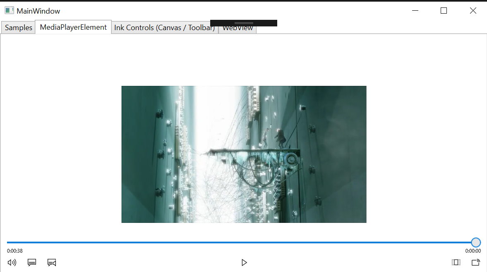

# MediaPlayerElement control for Windows Forms and WPF

The **MediaPlayerElement** control embeds a view that streams and renders media content such as video in your Windows Forms or WPF desktop application.



## About MediaPlayerElement control

The WPF version of this control is located in the **Microsoft.Toolkit.Wpf.UI.Controls** namespace. The Windows Forms version is coming soon, and it will be located in the **Microsoft.Toolkit.Forms.UI.Controls** namespace. You can find additional related types (such as enums and event args classes) in the **Microsoft.Toolkit.Win32.UI.Controls.Interop.WinRT** namespace.

Internally, this control wraps the UWP [Windows.UI.Xaml.Controls.MediaPlayerElement](https://docs.microsoft.com/uwp/api/Windows.UI.Xaml.Controls.MediaPlayerElement) control.

## Known Limitations

* This controls does not currently support full screen video.
* The **Source** property is exposed as a string, which is interpreted as a URL and bound to the **Source** property of the internal UWP control as a UWP-implemented **IMediaPlaybackSource**.

## Syntax
```xaml
<Window x:Class="TestSample.MainWindow" ...
  xmlns:controls="clr-namespace:Microsoft.Toolkit.Wpf.UI.Controls;assembly=Microsoft.Toolkit.Wpf.UI.Controls"
...>

<controls:MediaPlayerElement x:Name="mediaPlayerElement"
    Source="https://mediaplatstorage1.blob.core.windows.net/windows-universal-samples-media/elephantsdream-clip-h264_sd-aac_eng-aac_spa-aac_eng_commentary-srt_eng-srt_por-srt_swe.mkv"
    AutoPlay="True" Margin="5" HorizontalAlignment="Stretch"  VerticalAlignment="Stretch" AreTransportControlsEnabled="True" />
```

## Properties

| Property | Type | Description |
| -- | -- | -- |
| AreTransportControlsEnabled | bool | Wraps the [AreTransportControlsEnabled](https://docs.microsoft.com/uwp/api/windows.ui.xaml.controls.mediaplayerelement.aretransportcontrolsenabled) property of the internal UWP **MediaPlayerElement** control. |
| AreTransportControlsEnabledProperty | DependencyProperty | Dependency property for the **AreTransportControlsEnabled** property. |
| AutoPlay | bool | Wraps the [AutoPlay](https://docs.microsoft.com/uwp/api/windows.ui.xaml.controls.mediaplayerelement.autoplay) property of the internal UWP **MediaPlayerElement** control. |
| AutoPlayProperty | DependencyProperty | Dependency property for the **ActiAutoPlayveTool** property. |
| IsFullWindow | bool | Wraps the [IsFullWindow](https://docs.microsoft.com/uwp/api/windows.ui.xaml.controls.mediaplayerelement.isfullwindow) property of the internal UWP **MediaPlayerElement** control. |
| IsFullWindowProperty | DependencyProperty | Dependency property for the **IsFullWindow** property. |
| MediaPlayer | Microsoft.Toolkit.Win32.UI.Controls.Interop.WinRT.MediaPlayer | Wraps the [MediaPlayer](https://docs.microsoft.com/uwp/api/windows.ui.xaml.controls.mediaplayerelement.mediaplayer) property of the internal UWP **MediaPlayerElement** control. |
| MediaPlayerProperty | DependencyProperty | Dependency property for the **MediaPlayer** property. |
| PosterSource | Microsoft.Toolkit.Win32.UI.Controls.Interop.WinRT.ImageSource | Wraps the [PosterSource](https://docs.microsoft.com/uwp/api/windows.ui.xaml.controls.mediaplayerelement.postersource) property of the internal UWP **MediaPlayerElement** control. |
| PosterSourceProperty | DependencyProperty | Dependency property for the **PosterSource** property. |
| Source | string | Wraps the [Source](https://docs.microsoft.com/uwp/api/windows.ui.xaml.controls.mediaplayerelement.source) property of the internal UWP **MediaPlayerElement** control. The **Source** property of this wrapped control is exposed as a string, which is interpreted as a URL and bound to the **Source** property of the internal UWP control as a UWP-implemented **IMediaPlaybackSource**.|
| SourceProperty | DependencyProperty | Dependency property for the **Source** property. |
| Stretch | Microsoft.Toolkit.Win32.UI.Controls.Interop.WinRT.Stretch | Wraps the [Stretch](https://docs.microsoft.com/uwp/api/windows.ui.xaml.controls.mediaplayerelement.stretch) property of the internal UWP **MediaPlayerElement** control. |
| StretchProperty | DependencyProperty | Dependency property for the **Stretch** property. |
| TransportControls | Microsoft.Toolkit.Win32.UI.Controls.Interop.WinRT.MediaTransportControls | Wraps the [TransportControls](https://docs.microsoft.com/uwp/api/windows.ui.xaml.controls.mediaplayerelement.transportcontrols) property of the internal UWP **MediaPlayerElement** control. |

## Methods


| Methods | Return Type | Description |
| -- | -- | -- |
| SetMediaPlayer(MediaPlayer) | void | Wraps the [SetMediaPlayer](https://docs.microsoft.com/uwp/api/windows.ui.xaml.controls.mediaplayerelement.setmediaplayer) method of the internal UWP **MediaPlayerElement** control. |


## Requirements

| Device family | .NET 4.6.2, Windows 10 (introduced v10.0.17110.0) |
| -- | -- |
| Namespace | Microsoft.Toolkit.Forms.UI.Controls, Microsoft.Toolkit.Wpf.UI.Controls |
| NuGet package | [Microsoft.Toolkit.Win32.UI.Controls](https://www.nuget.org/packages/Microsoft.Toolkit.Win32.UI.Controls/) |

## API Source Code

- [MediaPlayerElement (Windows Forms)](https://github.com/Microsoft/WindowsCommunityToolkit/tree/master/Microsoft.Toolkit.Win32/Microsoft.Toolkit.Forms.UI.Controls/MediaPlayerElement)
- [MediaPlayerElement (WPF)](https://github.com/Microsoft/WindowsCommunityToolkit/tree/master/Microsoft.Toolkit.Win32/Microsoft.Toolkit.Wpf.UI.Controls/MediaPlayerElement)


## Related Topics

- [MediaPlayerElement (UWP)](https://docs.microsoft.com/en-us/uwp/api/Windows.UI.Xaml.Controls.MediaPlayerElement)
- [Media playback](https://docs.microsoft.com/windows/uwp/design/controls-and-patterns/media-playback)
