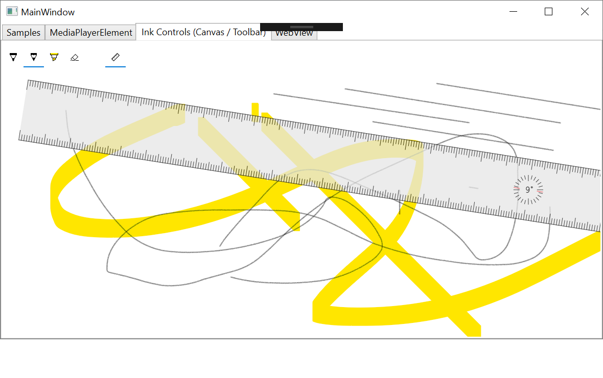

# InkCanvas control for Windows Forms and WPF

The **InkCanvas** control provides a surface for Windows Ink-based user interaction in your Windows Forms or WPF desktop application. This control embeds a panel that receives and displays all pen input as either an ink stroke or an erase stroke.



## About InkCanvas control

The WPF version of this control is located in the **Microsoft.Toolkit.Wpf.UI.Controls** namespace. The Windows Forms version is coming soon, and it will be located in the **Microsoft.Toolkit.Forms.UI.Controls** namespace. You can find additional related types (such as event args classes) in the **Microsoft.Toolkit.Win32.UI.Controls.Interop.WinRT** namespace.

Internally, these controls wrap the UWP [Windows.UI.Xaml.Controls.InkCanvas](https://docs.microsoft.com/uwp/api/Windows.UI.Xaml.Controls.InkCanvas) class.

## Known Limitations
These controls, like the UWP class, provide no interaction without an associated [InkToolbar](InkToolbar.md) with the interaction mode set. You'll also find it may not show ink properly while running on a device that uses the Windows 10 dark theme.

## Syntax
```xaml
<Window x:Class="TestSample.MainWindow" ...
  xmlns:controls="clr-namespace:Microsoft.Toolkit.Wpf.UI.Controls;assembly=Microsoft.Toolkit.Wpf.UI.Controls"
...>


<controls:InkCanvas x:Name="inkCanvas" DockPanel.Dock="Top" Loaded="inkCanvas_Loaded"/>
```

## Properties

| Property | Type | Description |
| -- | -- | -- |
| InkPresenter | Microsoft.Toolkit.Win32.UI.Controls.Interop.WinRT.InkPresenter | Wraps the [InkPresenter](https://docs.microsoft.com/uwp/api/windows.ui.xaml.controls.inkcanvas.inkpresenter) property of the internal UWP **InkCanvas** control. |


## Requirements

| Device family | .NET 4.6.2, Windows 10 (introduced v10.0.17110.0) |
| -- | -- |
| Namespace | Microsoft.Toolkit.Forms.UI.Controls, Microsoft.Toolkit.Wpf.UI.Controls |
| NuGet package | [Microsoft.Toolkit.Win32.UI.Controls](https://www.nuget.org/packages/Microsoft.Toolkit.Win32.UI.Controls/) |

## API Source Code

- [InkCanvas (Windows Forms)](https://github.com/Microsoft/WindowsCommunityToolkit/tree/master/Microsoft.Toolkit.Win32/Microsoft.Toolkit.Forms.UI.Controls/InkCanvas)
- [InkCanvas (WPF)](https://github.com/Microsoft/WindowsCommunityToolkit/tree/master/Microsoft.Toolkit.Win32/Microsoft.Toolkit.WPF.UI.Controls/InkCanvas)


## Related Topics

- [InkCanvas (UWP)](https://docs.microsoft.com/en-us/uwp/api/Windows.UI.Xaml.Controls.InkCanvas)
- [Pen and Windows Ink](https://docs.microsoft.com/windows/uwp/design/input/pen-and-stylus-interactions)
