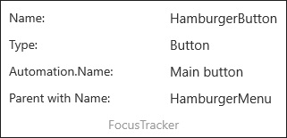

# FocusTracker XAML Control 

The **FocusTracker Control** can be used to display information about the current focused XAML element (if any).

**FocusTracker** will display the following information (when available) about the current focused XAML element:
- Name
- Type
- AutomationProperties.Name
- Name of the first parent in hierarchy with a name

## Syntax

```xml

<developerTools:FocusTracker IsActive="True"/>

```

## Example Image



## Requirements (Windows 10 Device Family)

| [Device family](http://go.microsoft.com/fwlink/p/?LinkID=526370) | Universal, 10.0.14393.0 or higher |
| --- | --- |
| Namespace | Microsoft.Toolkit.Uwp.DeveloperTools |

## API

* [FocusTracker source code](https://github.com/Microsoft/UWPCommunityToolkit/tree/master/Microsoft.Toolkit.Uwp.DeveloperTools/FocusTracker)

