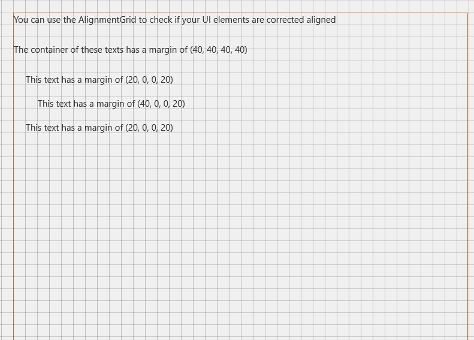

# AlignmentGrid XAML Control 

The [AlignmentGrid Control](https://docs.microsoft.com/dotnet/api/microsoft.toolkit.uwp.developertools.alignmentgrid) can be used to display a grid to help with aligning controls.

You can control the grid's steps with `HorizontalStep` and `VerticalStep` properties. Line color can be defined with `LineBrush` property.

## Syntax

```xaml
<developerTools:AlignmentGrid Opacity="1" LineBrush="Black"
                    HorizontalStep="20" VerticalStep="20"/>
```

## Sample Output



## Properties

| Property | Type | Description |
| -- | -- | -- |
| HorizontalStep | double | Gets or sets the step to use horizontally |
| LineBrush | Brush | Gets or sets line Brush |
| VerticalStep | double | Gets or sets the step to use vertically |

## Sample Code

[AlignmentGrid Sample Page Source](https://github.com/Microsoft/WindowsCommunityToolkit//tree/master/Microsoft.Toolkit.Uwp.SampleApp/SamplePages/AlignmentGrid). You can see this in action in [Windows Community Toolkit Sample App](https://www.microsoft.com/store/apps/9NBLGGH4TLCQ).

## Requirements

| Device family | Universal, 10.0.15063.0 or higher |
| --- | --- |
| Namespace | Microsoft.Toolkit.Uwp.DeveloperTools |
| NuGet package | [Microsoft.Toolkit.Uwp.DeveloperTools](https://www.nuget.org/packages/Microsoft.Toolkit.Uwp.DeveloperTools/) |

## API

* [AlignmentGrid source code](https://github.com/Microsoft/WindowsCommunityToolkit//tree/master/Microsoft.Toolkit.Uwp.DeveloperTools/AlignmentGrid)

