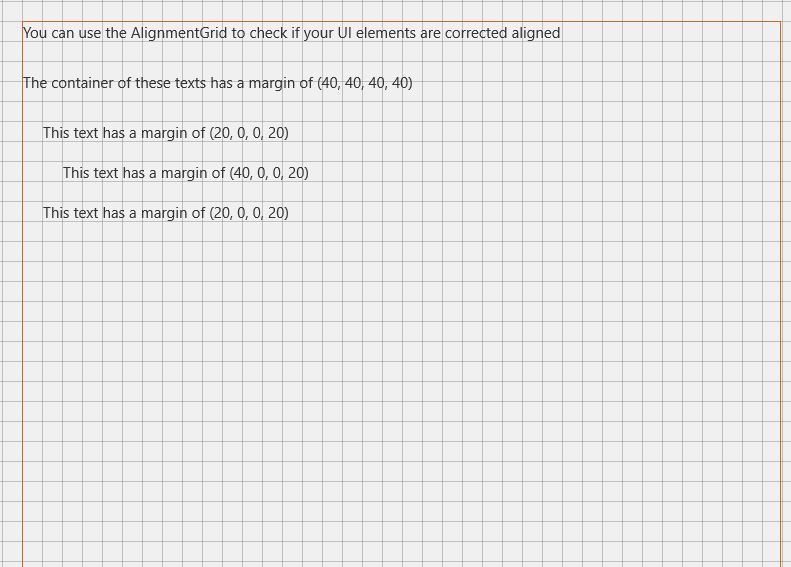

# AlignmentGrid XAML Control 

The **AlignmentGrid Control** can be used to display a grid to help aligning controls.

You can control grid's steps with `HorizontalStep` and `VerticalStep` properties.
Line color can be defined with `LineBrush` property.

## Syntax

```xml

<developerTools:AlignmentGrid
                    Opacity="1"
                    LineBrush="Black"
                    HorizontalStep="20"
                    VerticalStep="20"/>

```

## Example Image



## Requirements (Windows 10 Device Family)

| [Device family](http://go.microsoft.com/fwlink/p/?LinkID=526370) | Universal, 10.0.14393.0 or higher |
| --- | --- |
| Namespace | Microsoft.Toolkit.Uwp.DeveloperTools |

## API

* [AlignmentGrid source code](https://github.com/Microsoft/UWPCommunityToolkit/tree/master/Microsoft.Toolkit.Uwp.DeveloperTools/AlignmentGrid)

