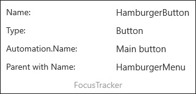

# FocusTracker XAML Control 

The [FocusTracker Control](https://docs.microsoft.com/dotnet/api/microsoft.toolkit.uwp.developertools.focustracker) can be used to display information about the current focused XAML element (if any).

FocusTracker will display the following information (when available) about the current focused XAML element:
- Name
- Type
- AutomationProperties.Name
- Name of the first parent in hierarchy with a name

## Syntax

```xaml
<developerTools:FocusTracker IsActive="True"/>
```

## Sample Output



## Properties

| Property | Type | Description |
| -- | -- | -- |
| IsActive | bool | Gets or sets a boolean indicating whether the tracker is running or not |

## Sample Code

[FocusTracker Sample Page Source](https://github.com/Microsoft/WindowsCommunityToolkit//tree/master/Microsoft.Toolkit.Uwp.SampleApp/SamplePages/FocusTracker). You can see this in action in [Windows Community Toolkit Sample App](https://www.microsoft.com/store/apps/9NBLGGH4TLCQ).

## Requirements

| Device family | Universal, 10.0.15063.0 or higher |
| --- | --- |
| Namespace | Microsoft.Toolkit.Uwp.DeveloperTools |
| NuGet package | [Microsoft.Toolkit.Uwp.DeveloperTools](https://www.nuget.org/packages/Microsoft.Toolkit.Uwp.DeveloperTools/) |

## API

* [FocusTracker source code](https://github.com/Microsoft/WindowsCommunityToolkit//tree/master/Microsoft.Toolkit.Uwp.DeveloperTools/FocusTracker)

