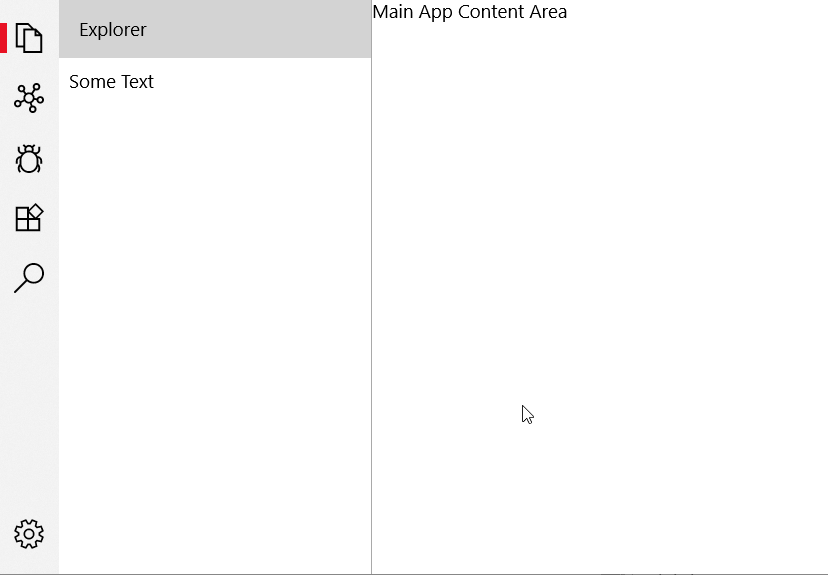

# NavigationView Styles
<!-- Describe your control -->
The [NavigationView Styles](https://docs.microsoft.com/en-us/windows/uwpcommunitytoolkit/extensions/navigationview) are a set of styles and extensions to reskin a `NavigationView` to look and behave like the `Activity Bar` and `Side Bar` in *Visual Studio Code*.

This can create a companion 'toolbox' style experience for navigation along-side the main, more 'static', content of an app.

## Example Image



## Example Code

The following example shows you how to modify a NavigationView to use the Visual Studio Code styles directly in your XAML code:

```xaml
    ... xmlns:ex="using:Microsoft.Toolkit.Uwp.UI.Extensions">
  
    <Page.Resources>
      <ResourceDictionary>
        <ResourceDictionary.MergedDictionaries>
          <ResourceDictionary Source="ms-appx:///Microsoft.Toolkit.Uwp.UI/Extensions/NavigationView/Styles/VSCodeActivityBarStyle.xaml" />
        </ResourceDictionary.MergedDictionaries>
      </ResourceDictionary>
    </Page.Resources>

    <NavigationView x:Name="NavMenu"
                    Style="{StaticResource VSCodeActivityBarStyle}"
                    MenuItemContainerStyle="{StaticResource LargeIconNavigationViewItemStyle}"
                    ex:NavigationViewExtensions.SelectedIndex="0"
                    ex:NavigationViewExtensions.CollapseOnClick="True">
        <NavigationView.MenuItems>
            <NavigationViewItem Content="Explorer" Tag="Some Text">
                <NavigationViewItem.Icon>
                    <FontIcon Glyph="&#xE8C8;"/>
                </NavigationViewItem.Icon>
    ...

```

You need to include the toolkit extensions namespace, add the style dictionary to your resources, utilize the styles, and add the extension properties to modify the behavior.

## Properties

| Property | Type | Description |
| -- | -- | -- |
| NavigationViewExtensions.SelectedIndex | int | Changes the `NavigationView`'s selected item based on its index.  A value out of range will deselect any item. |
| NavigationViewExtensions.CollapseOnClick | bool | Changes the `NavigationView` behavior so When a user clicks on an already selected `NavigationViewItem` its content's visibility will collapse. |

## Sample Code

[NavigationView Styles Sample Page](https://github.com/Microsoft/WindowsCommunityToolkit//tree/master/Microsoft.Toolkit.Uwp.SampleApp/SamplePages/NavigationViewStyles). You can see this in action in [Windows Community Toolkit Sample App](https://www.microsoft.com/store/apps/9NBLGGH4TLCQ).

## Requirements

| [Device family](http://go.microsoft.com/fwlink/p/?LinkID=526370) | Universal, 10.0.16299.0 or higher |
| --- | --- |
| Namespace | Microsoft.Toolkit.Uwp.UI.Extensions |
| NuGet package | [Microsoft.Toolkit.Uwp.UI](https://www.nuget.org/packages/Microsoft.Toolkit.Uwp.UI/) |

## API Source Code

- [NavigationView Styles source code](https://github.com/Microsoft/WindowsCommunityToolkit//tree/master/Microsoft.Toolkit.Uwp.UI/Extensions/NavigationView)

## Related Topics

- [Visual Studio Code interface](https://code.visualstudio.com/docs/getstarted/userinterface)
- [NavigationView class](https://docs.microsoft.com/en-us/uwp/api/windows.ui.xaml.controls.navigationview)
- [NavigationView guide](https://docs.microsoft.com/en-us/windows/uwp/design/controls-and-patterns/navigationview)
