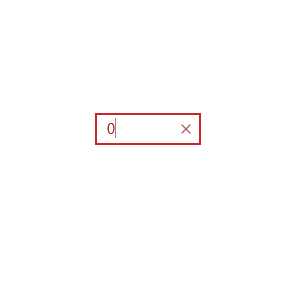

# SurfaceDialTextboxHelper XAML Property

The [SurfaceDialTextboxHelper XAML Property](https://docs.microsoft.com/windows/uwpcommunitytoolkit/extensions/surfacedialtextboxhelper) adds features from the Surface Dial control to a numeric TextBox. This enables you to modify the content of the TextBox when rotating the Surface Dial (increasing or decreasing the value) and optionally go to the next focus element by tapping the Surface Dial click button.

## Syntax

```xaml
<Page ...
     xmlns:extensions="using:Microsoft.Toolkit.Uwp.UI.Extensions">

<TextBox Width="106"
          HorizontalAlignment="Left"
          VerticalAlignment="Top"
          extensions:SurfaceDialTextboxHelper.EnableHapticFeedback="True"
          extensions:SurfaceDialTextboxHelper.EnableMinMaxValue="True"
          extensions:SurfaceDialTextboxHelper.EnableTapToNextControl="False"
          extensions:SurfaceDialTextboxHelper.ForceMenuItem="True"
          extensions:SurfaceDialTextboxHelper.Icon="Ruler"
          extensions:SurfaceDialTextboxHelper.MaxValue="0"
          extensions:SurfaceDialTextboxHelper.MinValue="100"
          extensions:SurfaceDialTextboxHelper.StepValue="1"
          Text="0" />  
```

## Example Image



## Attached Properties

| Property | Type | Description |
| -- | -- | -- |
| EnableHapticFeedback | bool | A flag to enable or disable haptic feedback when rotating the dial for the give TextBox. This is enabled by default |
| EnableMinMaxValue | bool | EnableMinMax limits the value in the textbox to your spesificed Min and Max values, see the other properties |
| EnableTapToNextControl | bool | TapToNext is a feature you can set to automatically try to focus the next focusable element from the Surface Dial enabled TextBox. This is on dy default |
| ForceMenuItem | bool | If you provide the Controller yourself, set this to true so you won't add new menu items  |
| Icon | [RadialControllerMenuKnownIcon](https://docs.microsoft.com/uwp/api/windows.ui.input.radialcontrollermenuknownicon) | Set the default icon of the menu item that gets added. A user will most likely not see this. Defaults to the Ruler icon |
| MaxValue | double | Sets the maxium value the TextBox can have when modifying it using a Surface Dial. Default is 100.0 |
| MinValue | double | Sets the minimum value the TextBox can have when modifying it using a Surface Dial. Default is -100.0 |
| StepValue | double | The amount the TextBox will be modified for each rotation step on the Surface Dial |

> [!IMPORTANT]
`StepValue` and `ForceMenuItem` are mandatory fields

## Properties

| Property | Type | Description |
| -- | -- | -- |
| static Controller | [RadialController](https://docs.microsoft.com/uwp/api/Windows.UI.Input.RadialController) | Gets or sets the controller for the Surface Dial. The RadialController can be set from your app logic in case you use Surface Dial in other custom cases than on a TextBox. This helper class will do everything for you, but if you want to control the Menu Items and/or wish to use the same Surface Dial insta This is the property for the static controller so you can access it if needed. |
| static IsSupported | bool | Gets a value indicating whether this attached proeprty is supported |

## Sample Code

[SurfaceDialTextboxHelper Sample Page](https://github.com/Microsoft/UWPCommunityToolkit/tree/master/Microsoft.Toolkit.Uwp.SampleApp/SamplePages/SurfaceDialTextboxHelper). You can see this in action in [UWP Community Toolkit Sample App](https://www.microsoft.com/store/apps/9NBLGGH4TLCQ).

## Requirements

| Device family | Universal, 10.0.14393.0 or higher |
| --- | --- |
| Namespace | Microsoft.Toolkit.Uwp.UI.Extensions |
| NuGet package | [Microsoft.Toolkit.Uwp.UI](https://www.nuget.org/packages/Microsoft.Toolkit.Uwp.UI/) |

## API

* [SurfaceDialTextboxHelper source code](https://github.com/Microsoft/UWPCommunityToolkit/tree/master/Microsoft.Toolkit.Uwp.UI/Extensions/SurfaceDialTextbox)
