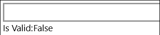

# TextBoxRegex XAML Property

The [TextBoxRegex Property](https://docs.microsoft.com/dotnet/api/microsoft.toolkit.uwp.ui.extensions.textboxregex) allows text validation using a regular expression or using built in validation types.

The developer adds a regular expression to validate the TextBox Text against the regular expression throw Regex property or from selecting ValidationType property on the TextBox.

The validation has 2 modes (`ValidationMode`):
1) Normal (Default) : This type will set TextBox IsValid attached property to false or true whether the TextBox text is a valid or not against the Regex property.
2) Dynamic : This type extends 1) Normal and if is the newest input of the Textbox  is invalid, the character which is invalied will be deleted.


Main Attached Properties:
1) Regex : this property used to set the regular expression that will be used to validate the TextBox.
2) ValidationMode: Normal or Dynamic.
3) ValidationType: use a built in predefined validation types Email, Decimal, Phone Number, Character or Number.
Note that ValidationType Email and Phone Number not support the ValidationMode Dynamic. If you set the ValidationMode to Dynamic, the ValidationMode Normal is selected automatically.

## Syntax

```xaml
<TextBox extensions:TextBoxRegex.Regex="^\s*\+?\s*([0-9][\s-]*){9,}$" />

<TextBox extensions:TextBoxRegex.ValidationMode="Normal"
    extensions:TextBoxRegex.ValidationType="PhoneNumber"
    Text="+61616161611" />

<TextBox extensions:TextBoxRegex.ValidationType="Email"   />

<TextBox extensions:TextBoxRegex.ValidationMode="Dynamic"
    extensions:TextBoxRegex.ValidationType="Decimal" />
```

## Sample Output

Text box with ValidationType=Email, validation occurs on TextChanged



## Attached Properties

| Property | Type | Description |
| -- | -- | -- |
| IsValid | bool | Represents the custom mask that the user can create to add his own variable characters based on regex expression |
| Regex | string | Set the regular expression that will be used to validate the TextBox |
| ValidationMode | [ValidationMode](https://docs.microsoft.com/dotnet/api/microsoft.toolkit.uwp.ui.extensions.textboxregex.validationmode) | Set validation mode. Normal or Forced |
| ValidationType | [ValidationType](https://docs.microsoft.com/dotnet/api/microsoft.toolkit.uwp.ui.extensions.textboxregex.validationtype) | Set a built in predefined validation types Email, Decimal, Phone Number, Character or Number |

## Examples

The following sample demonstrates how to add TextBoxRegex property.

```xaml
<Page x:Class="Microsoft.Toolkit.Uwp.SampleApp.SamplePages.TextBoxRegexPage"
      xmlns="http://schemas.microsoft.com/winfx/2006/xaml/presentation"
      xmlns:x="http://schemas.microsoft.com/winfx/2006/xaml"
      xmlns:common="using:Microsoft.Toolkit.Uwp.SampleApp.Common"
      xmlns:extensions="using:Microsoft.Toolkit.Uwp.UI.Extenions"
      xmlns:d="http://schemas.microsoft.com/expression/blend/2008"
      xmlns:mc="http://schemas.openxmlformats.org/markup-compatibility/2006"
      mc:Ignorable="d">

    <Page.Resources>
    <common:BoolStringConverter x:Key="StringFormatConverter" />
    <Style x:Key="TextBoxRegexStyle"
           TargetType="TextBox">
      <Setter Property="VerticalAlignment" Value="Top" />
      <Setter Property="TextWrapping" Value="Wrap" />
    </Style>
    <DataTemplate x:Key="HeaderTemplate">
      <StackPanel>
        <TextBlock Text="{Binding}"
                   TextWrapping="WrapWholeWords" />
      </StackPanel>
    </DataTemplate>
  </Page.Resources>

  <Grid Background="{ThemeResource ApplicationPageBackgroundThemeBrush}">
        <ScrollViewer VerticalScrollBarVisibility="Auto" VerticalScrollMode="Auto">
    <Grid Margin="30">
      <Grid.RowDefinitions>
        <RowDefinition />
        <RowDefinition />
        <RowDefinition />
        <RowDefinition />
        <RowDefinition />
      </Grid.RowDefinitions>

                <StackPanel Margin="10,10,10,0">
        <TextBox Name="PhoneNumberValidator"
                 extensions:TextBoxRegex.Regex="^\s*\+?\s*([0-9][\s-]*){9,}$"
                 Header="Text box with Regex extension for phone number, validation occurs on TextChanged"
                 HeaderTemplate="{StaticResource HeaderTemplate}"
                 Style="{StaticResource TextBoxRegexStyle}" />
        <StackPanel Orientation="Horizontal">
          <TextBlock Text="Is Valid: " />
          <TextBlock Text="{Binding (extensions:TextBoxRegex.IsValid), ElementName=PhoneNumberValidator, Converter={StaticResource StringFormatConverter}}" />
        </StackPanel>

      </StackPanel>

      <StackPanel Grid.Row="1"
                        Margin="10,10,10,0">
        <TextBox Name="CharactValidator"
                 extensions:TextBoxRegex.ValidationMode="Dynamic"
                 extensions:TextBoxRegex.ValidationType="Characters"
                 Header="Text box with ValidationType=Characters, validation occurs at input with ValidationMode=Dynamic and clear only single character when value is invalid"
                 HeaderTemplate="{StaticResource HeaderTemplate}"
                 Style="{StaticResource TextBoxRegexStyle}"
                 Text="abcdef" />
        <StackPanel Orientation="Horizontal">
          <TextBlock Text="Is Valid: " />
          <TextBlock Text="{Binding (extensions:TextBoxRegex.IsValid), ElementName=CharactValidator, Converter={StaticResource StringFormatConverter}}" />
        </StackPanel>
      </StackPanel>

      <StackPanel Grid.Row="2"
                        Margin="10,10,10,0">
        <TextBox Name="EmailValidator"
                 extensions:TextBoxRegex.ValidationType="Email"
                 Header="Text box with ValidationType=Email, validation occurs on TextChanged"
                 HeaderTemplate="{StaticResource HeaderTemplate}"
                 Style="{StaticResource TextBoxRegexStyle}" />
        <StackPanel Orientation="Horizontal">
          <TextBlock Text="Is Valid: " />
          <TextBlock Text="{Binding (extensions:TextBoxRegex.IsValid), ElementName=EmailValidator, Converter={StaticResource StringFormatConverter}}" />
        </StackPanel>
      </StackPanel>

      <StackPanel Grid.Row="3"
                        Margin="10,10,10,0">
        <TextBox Name="DecimalValidator"
                 extensions:TextBoxRegex.ValidationType="Decimal"
                 Header="Text box with ValidationType=Decimal, validation occurs on TextChanged with ValidationMode=Normal (333,111 or 333.111)"
                 HeaderTemplate="{StaticResource HeaderTemplate}"
                 Style="{StaticResource TextBoxRegexStyle}" />
        <StackPanel Orientation="Horizontal">
          <TextBlock Text="Is Valid: " />
          <TextBlock Text="{Binding (extensions:TextBoxRegex.IsValid), ElementName=DecimalValidator, Converter={StaticResource StringFormatConverter}}" />
        </StackPanel>
      </StackPanel>

      <StackPanel Grid.Row="4"
                        Margin="10,10,10,0">
        <TextBox Name="NumberValidatorDynamic"
                 extensions:TextBoxRegex.ValidationMode="Dynamic"
                 extensions:TextBoxRegex.ValidationType="Number"
                 Header="Text box with ValidationType=Number, validation occurs at input with ValidationMode=Dynamic and clear only single character when value is invalid"
                 HeaderTemplate="{StaticResource HeaderTemplate}"
                 Style="{StaticResource TextBoxRegexStyle}" />
        <StackPanel Orientation="Horizontal">
          <TextBlock Text="Is Valid: " />
          <TextBlock Text="{Binding (extensions:TextBoxRegex.IsValid), ElementName=NumberValidatorDynamic, Converter={StaticResource StringFormatConverter}}" />
        </StackPanel>
      </StackPanel>

    </Grid>
        </ScrollViewer>
  </Grid>
</Page>
```

## Sample Code

[TextBoxRegex Sample Page](https://github.com/Microsoft/UWPCommunityToolkit/tree/master/Microsoft.Toolkit.Uwp.SampleApp/SamplePages/TextBoxRegex). You can see this in action in [Windows Community Toolkit Sample App](https://www.microsoft.com/store/apps/9NBLGGH4TLCQ).

## Requirements

| Device family | Universal, 10.0.14393.0 or higher |
| --- | --- |
| Namespace | Microsoft.Toolkit.Uwp.UI.Extensions |
| NuGet package | [Microsoft.Toolkit.Uwp.UI](https://www.nuget.org/packages/Microsoft.Toolkit.Uwp.UI/) |

## API

* [TextBoxRegex source code](https://github.com/Microsoft/UWPCommunityToolkit/tree/master/Microsoft.Toolkit.Uwp.UI/Extensions/TextBoxRegEx)
