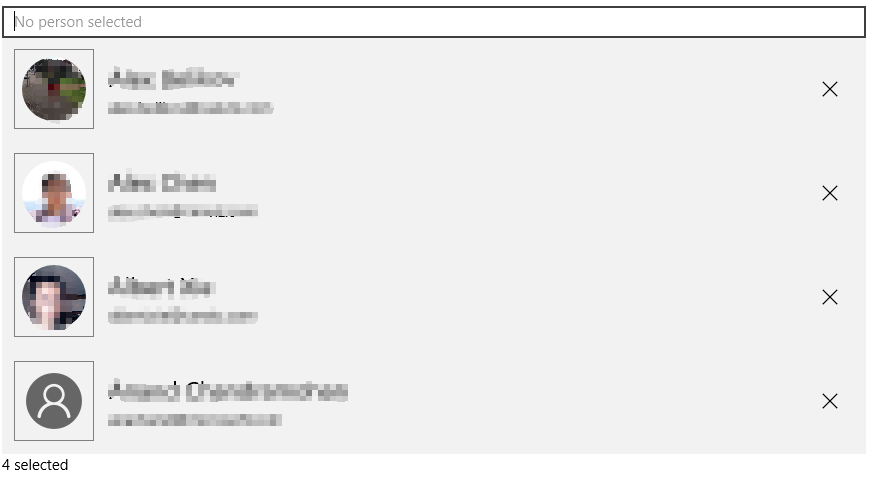

# PeoplePicker Control

The [PeoplePicker Control](https://docs.microsoft.com/dotnet/api/microsoft.toolkit.uwp.ui.controls.graph.peoplepicker) is a simple control that allows for selection of one or more users from an organizational AD, see more details [here](https://developer.microsoft.com/en-us/graph/docs/concepts/people_example), it relies on the [MicrosoftGraphService](../services/MicrosoftGraph.md) for authentication.

## Syntax

```xaml
<Page ...
    xmlns:controls="using:Microsoft.Toolkit.Uwp.UI.Controls.Graph"/>

<controls:PeoplePicker x:Name="PeoplePicker1"
    AllowMultiple="True" />
```

## Example Image



## Properties

| Property | Type | Description |
| -- | -- | -- |
| RequiredDelegatedPermissions | String[] | Gets required delegated permissions for Graph API access |
| AllowMultiple | Boolean | Whether multiple people can be selected |
| SearchResultLimit | Int | Max person returned in the search results |
| PlaceholderText | String | Text to be displayed when no user is selected |
| Selections | ObservableCollection<Person> | The selected person list |

## Sample Code

First of all, initialize the [MicrosoftGraphService](../services/MicrosoftGraph.md) with your [Azure AD v2.0 app](https://docs.microsoft.com/en-us/azure/active-directory/develop/active-directory-v2-app-registration), this should be done globally with the combined and unique [delegate permissions](https://docs.microsoft.com/en-us/azure/active-directory/develop/active-directory-v2-scopes) required by all Graph controls and services used in your app.

```c#
MicrosoftGraphService.Instance.AuthenticationModel = MicrosoftGraphEnums.AuthenticationModel.V2;

MicrosoftGraphService.Instance.Initialize(
    'xxxxxxxx-xxxx-xxxx-xxxx-xxxxxxxxxxxx',
    MicrosoftGraphEnums.ServicesToInitialize.UserProfile,
    PeoplePicker.RequiredDelegatedPermissions
);
```

[PeoplePicker Sample Page Source](https://github.com/Microsoft/WindowsCommunityToolkit/tree/master/Microsoft.Toolkit.Uwp.SampleApp/SamplePages/PeoplePicker). You can see this in action in [Windows Community Toolkit Sample App](https://www.microsoft.com/store/apps/9NBLGGH4TLCQ).

## Default Template 

[PeoplePicker XAML File](https://github.com/Microsoft/WindowsCommunityToolkit/blob/master/Microsoft.Toolkit.Uwp.UI.Controls.Graph/PeoplePicker/PeoplePicker.xaml) is the XAML template used in the toolkit for the default styling.

## Requirements

| Device family | Universal, 10.0.15063.0 or higher |
| -- | -- |
| Namespace | Microsoft.Toolkit.Uwp.UI.Controls.Graph |
| NuGet package | [Microsoft.Toolkit.Uwp.UI.Controls.Graph](https://www.nuget.org/packages/Microsoft.Toolkit.Uwp.UI.Controls.Graph/) |

## API

* [PeoplePicker source code](https://github.com/Microsoft/WindowsCommunityToolkit/tree/master/Microsoft.Toolkit.Uwp.UI.Controls.Graph/PeoplePicker)
