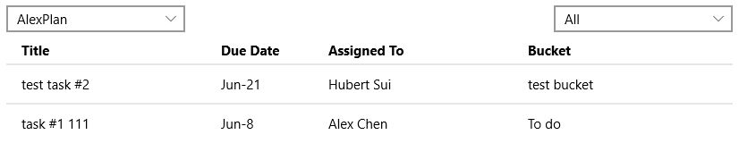

# PlannerTaskList Control

The [PlannerTaskList Control](https://docs.microsoft.com/dotnet/api/microsoft.toolkit.uwp.ui.controls.graph.plannertasklist) displays a simple list of Planner tasks, it relies on the [MicrosoftGraphService](../../docs/services/MicrosoftGraph.md) for authentication.

## Syntax

```xaml
<Page ...
    xmlns:controls="using:Microsoft.Toolkit.Uwp.UI.Controls.Graph"/>

<controls:PlannerTaskList x:Name="PlannerTaskList1" />
```

## Example Image



## Properties

| Property | Type | Description |
| -- | -- | -- |
| RequiredDelegatedPermissions | String[] | Gets required delegated permissions for Graph API access |
| PlanId | String | Gets or sets Id of Planner Plan to Display, this is optional. |
| DisplayPlanList | Boolean | Gets or sets a value indicating whether show plan list or not |
| DisplayBucketList | Boolean | Gets or sets a value indicating whether show bucket list or not |
| AllTasksLabel | String | Gets or sets label of all tasks |
| ClosedTasksLabel | String | Gets or sets label of closed tasks |

## Sample Code

First of all, initialize the [MicrosoftGraphService](../../docs/services/MicrosoftGraph.md) with your [Azure AD v2.0 app](https://docs.microsoft.com/en-us/azure/active-directory/develop/active-directory-v2-app-registration), this should be done globally with the combined and unique [delegate permissions](https://docs.microsoft.com/en-us/azure/active-directory/develop/active-directory-v2-scopes) required by all Graph controls and services used in your app.

```c#
MicrosoftGraphService.Instance.AuthenticationModel = MicrosoftGraphEnums.AuthenticationModel.V2;

MicrosoftGraphService.Instance.Initialize(
    "xxxxxxxx-xxxx-xxxx-xxxx-xxxxxxxxxxxx",
    MicrosoftGraphEnums.ServicesToInitialize.UserProfile,
    PlannerTaskList.RequiredDelegatedPermissions
);
```

[PlannerTaskList Sample Page Source](../../Microsoft.Toolkit.Uwp.SampleApp/SamplePages/PlannerTaskList). You can see this in action in [Windows Community Toolkit Sample App](https://www.microsoft.com/store/apps/9NBLGGH4TLCQ).

## Default Template 

[PlannerTaskList XAML File](../../Microsoft.Toolkit.Uwp.UI.Controls.Graph/PlannerTaskList/PlannerTaskList.xaml) is the XAML template used in the toolkit for the default styling.

## Requirements

| Device family | Universal, 10.0.15063.0 or higher |
| -- | -- |
| Namespace | Microsoft.Toolkit.Uwp.UI.Controls.Graph |
| NuGet package | [Microsoft.Toolkit.Uwp.UI.Controls.Graph](https://www.nuget.org/packages/Microsoft.Toolkit.Uwp.UI.Controls.Graph/) |

## API

* [PlannerTaskList source code](../../Microsoft.Toolkit.Uwp.UI.Controls.Graph/PlannerTaskList)
