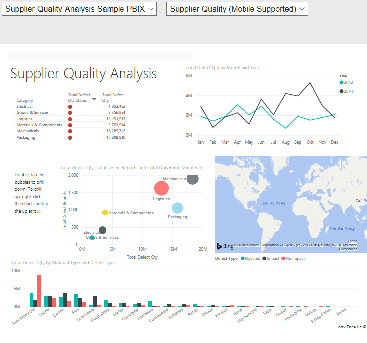
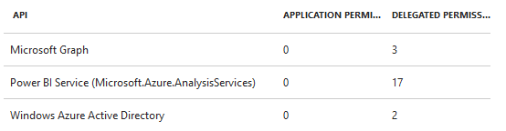

# PowerBIEmbedded Control

The [PowerBIEmbedded Control](https://docs.microsoft.com/dotnet/api/microsoft.toolkit.uwp.ui.controls.graph.powerbiembedded) is a simple wrapper to an IFRAME for a PowerBI embed.

## Syntax

```xaml
<Page ...
    xmlns:controls="using:Microsoft.Toolkit.Uwp.UI.Controls.Graph"/>

<controls:PowerBIEmbedded x:Name="PowerBIEmbedded1"
    ClientId="xxxxxxxx-xxxx-xxxx-xxxx-xxxxxxxxxxxx"
    GroupId="xxxxxxxx-xxxx-xxxx-xxxx-xxxxxxxxxxxx" />
```

## Example Image



## Properties

| Property | Type | Description |
| -- | -- | -- |
| ClientId | String | Gets or sets the client id of Azure AD app registration (v1) |
| GroupId | String | Gets or sets the identifier of a Group. Optional when EmbedUrl is specified, if this is used, a dropdown will appear that lets users select amongst different reports in a Group |
| EmbedUrl | String | Gets or sets the Url of the embed, optional when GroupId is specified |

## Integration

1. Follow the
[MicrosoftGraphService](../../docs/services/MicrosoftGraph.md#register-the-app-to-use-azure-ad-v1-endpoint) to create Azure AD app registration (v1), and grant the permissions below.
   - Microsoft Graph
     - Sign in and read user profile
     - Read all users' basic profiles
     - Sign users in
   - Windows Azure Active Directory
     - Access the directory as the signed-in user
     - Sign in and read user profile
   - Power BI Service (Microsoft.Azure.AnalysisServices)
     - All permissions which don't require admin consent

   

2. Follow this [article](https://docs.microsoft.com/en-us/power-bi/developer/embedding-content) to do the primary tasks below.

   - Create Power BI Pro user account
   - Create app workspaces
   - Create Power BI Embedded capacity
   - Create and publish reports

3. For better report experience in mobile, that's recommended to [design phone layout for mobile portrait view in PowerBI desktop](https://docs.microsoft.com/en-us/power-bi/desktop-create-phone-report).

## Sample Code

[PowerBIEmbedded Sample Page Source](../../Microsoft.Toolkit.Uwp.SampleApp/SamplePages/PowerBIEmbedded). You can see this in action in [Windows Community Toolkit Sample App](https://www.microsoft.com/store/apps/9NBLGGH4TLCQ).

## Default Template 

[PowerBIEmbedded XAML File](../../Microsoft.Toolkit.Uwp.UI.Controls.Graph/PowerBIEmbedded/PowerBIEmbedded.xaml) is the XAML template used in the toolkit for the default styling.

## Requirements

| Device family | Universal, 10.0.15063.0 or higher |
| -- | -- |
| Namespace | Microsoft.Toolkit.Uwp.UI.Controls.Graph |
| NuGet package | [Microsoft.Toolkit.Uwp.UI.Controls.Graph](https://www.nuget.org/packages/Microsoft.Toolkit.Uwp.UI.Controls.Graph/) |

## API

* [PowerBIEmbedded source code](../../Microsoft.Toolkit.Uwp.UI.Controls.Graph/PowerBIEmbedded)
