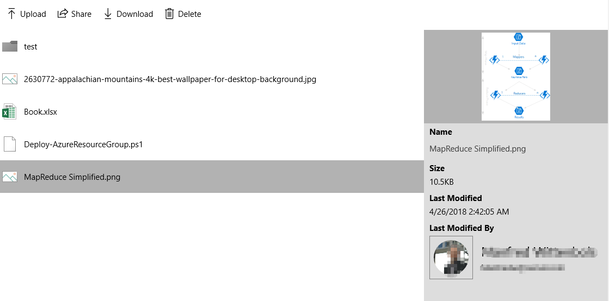

# SharePointFileList Control

The [SharePointFileList Control](https://docs.microsoft.com/dotnet/api/microsoft.toolkit.uwp.ui.controls.graph.sharepointfilelist) displays a simple list of SharePoint Files, it relies on the [AadAuthenticationManager](../../docs/graph/AadAuthenticationManager.md) for authentication.

## Syntax

```xaml
<Page ...
    xmlns:controls="using:Microsoft.Toolkit.Uwp.UI.Controls.Graph"/>

<controls:SharePointFileList x:Name="SharePointFileList1"
    DetailPane="Side"
    DriveUrl="https://contoso.sharepoint.com/sites/DemoSite/DemoLib" />
```

## Example Image



## Properties

| Property | Type | Description |
| -- | -- | -- |
| RequiredDelegatedPermissions | String[] | Gets required delegated permissions for Graph API access |
| DriveUrl | String | Full URL of the Drive being displayed |
| DetailPane | [DetailPaneDisplayMode](../../Microsoft.Toolkit.Uwp.UI.Controls.Graph/SharePointFileList/DetailPaneDisplayMode.cs) | Determines whether file details are displayed, when a file is selected |
| PageSize | Int | Page size of each request |
| ShareLinkCopiedMessage | String | The message when share link copied |
| AllFilesMessage | String | The label of All Files |
| DeleteConfirmMessage | String | The message of delete confirm dialog |
| DeleteConfirmOkMessage | String | The caption of ok button in delete confirm dialog |
| DeleteConfirmCancelMessage | String | The caption of cancel button in delete confirm dialog |
| UploadingFilesMessageTemplate | String | The template of uploading files |

## Methods

| Method | Return Type | Description |
| -- | -- | -- |
| GetDriveUrlFromSharePointUrlAsync | String | Retrieves an appropriate Drive URL from a SharePoint document library root URL |

## Events

| Event | Return Type | Description |
| -- | -- | -- |
| FileSelected | EventHandler&lt;FileSelectedEventArgs&gt; | Occurs when one of the menu items in the control is clicked |

## Sample Code

First all all, initialize the Azure AD authentication manager, this should be done globally with all required delegate permissions if multiple Graph controls in this package are used in your app.

```c#
AadAuthenticationManager.Instance.Initialize(
    'xxxxxxxx-xxxx-xxxx-xxxx-xxxxxxxxxxxx',
    new string[] { "User.Read", "User.ReadBasic.All" }
);
```

[SharePointFileList Sample Page Source](../../Microsoft.Toolkit.Uwp.SampleApp/SamplePages/SharePointFileList). You can see this in action in [Windows Community Toolkit Sample App](https://www.microsoft.com/store/apps/9NBLGGH4TLCQ).

## Default Template 

[SharePointFileList XAML File](../../Microsoft.Toolkit.Uwp.UI.Controls.Graph/SharePointFileList/SharePointFileList.xaml) is the XAML template used in the toolkit for the default styling.

## Requirements

| Device family | Universal, 10.0.14393.0 or higher |
| -- | -- |
| Namespace | Microsoft.Toolkit.Uwp.UI.Controls.Graph |
| NuGet package | [Microsoft.Toolkit.Uwp.UI.Controls.Graph](https://www.nuget.org/packages/Microsoft.Toolkit.Uwp.UI.Controls.Graph/) |

## API

* [SharePointFileList source code](../../Microsoft.Toolkit.Uwp.UI.Controls.Graph/SharePointFileList)
