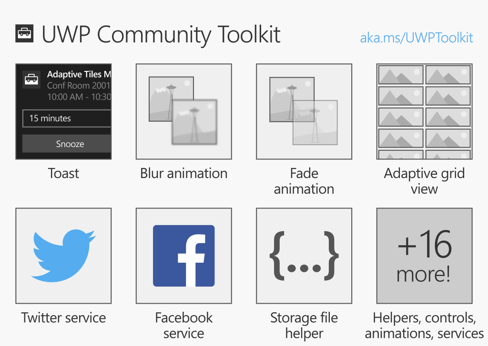

# UWP Community Toolkit Documentation

The UWP Community Toolkit is a collection of helper functions, custom controls, and app services. It simplifies and demonstrates common developer tasks building UWP apps for Windows 10. 

The toolkit can be used to build UWP apps for any Windows 10 device, including PC, Mobile, XBOX, IoT and HoloLens. You can also use the toolkit with an existing desktop app converted to UWP using the Desktop Bridge.             

The UWP Community Toolkit is available as a Visual Studio NuGet package for new or existing C# and VB.NET projects. Read the [Getting Started](Getting-Started.md) page for all the details.

You can also preview the capabilities of the toolkit by downloading the [UWP Community Toolkit Sample App](http://aka.ms/uwptoolkitapp) in the Windows Store.

Feel free to browse the documentation using the table of contents on the left side of this page.

## Open Source

[UWP Community Toolkit Source Code ](http://aka.ms/uwptoolkit)

Built as an open source project hosted on GitHub with support from the community. 
