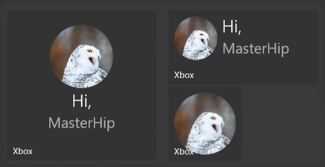

# Notifications Overview 

Adaptive Live Tiles and interactive Toasts are key engagement components of a UWP Application on Windows 10.
Instead of having to deal with XML, you can now use Windows Community toolkit and its notification extensions to work with Tiles and notifications using a complete object model.

## Tiles

| Documentation |
| --- |
| [Adaptive Tile Notifications](https://blogs.msdn.microsoft.com/tiles_and_toasts/2015/06/30/adaptive-tile-templates-schema-and-documentation/) |
| [Quickstart: Sending a local Tile notification](https://blogs.msdn.microsoft.com/tiles_and_toasts/2015/10/05/quickstart-sending-a-local-tile-notification-in-windows-10/) |

## Sample Output

## Toasts

| Documentation |
| --- |
| [Interactive Toast Notifications](https://blogs.msdn.microsoft.com/tiles_and_toasts/2015/07/02/adaptive-and-interactive-toast-notifications-for-windows-10/) |
| [Quickstart: Sending a local Toast notification](https://blogs.msdn.microsoft.com/tiles_and_toasts/2015/07/08/quickstart-sending-a-local-toast-notification-and-handling-activations-from-it-windows-10/) |

## Sample Output

## Requirements

| Device family | Universal, 10.0.15063.0 or higher |
| --- | --- |
| Namespace for C# | Microsoft.Toolkit.Uwp.Notifications |
| Namespace for JavaScript | Microsoft.Toolkit.Uwp.Notifications.Javascript |

## API

* [Notifications source code](https://github.com/Microsoft/WindowsCommunityToolkit//tree/master/Notifications/Microsoft.Toolkit.Uwp.Notifications.UWP)
