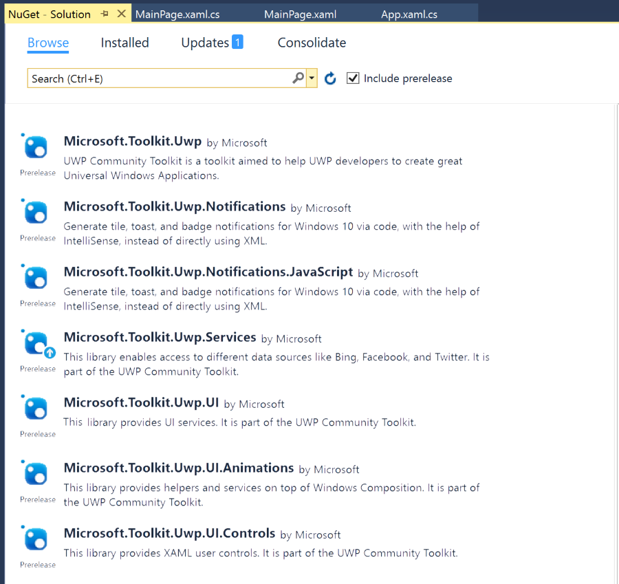

Windows Community Toolkit
===========

The Windows Community Toolkit is a collection of helper functions, custom controls, and app services. It simplifies and demonstrates common developer tasks building UWP apps for Windows 10.

## Build status
| Target | Branch | Status | Recommended Nuget packages version |
| ------ | ------ | ------ | ------ |
| Pre-release beta testing | master |  |  |

<!-- | Production | rel/3.0.0 |  |  | -->

## Getting started
Please read the [getting Started with the Windows Community Toolkit](https://docs.microsoft.com/windows/uwpcommunitytoolkit/getting-started) page for more detailed information about using the toolkit.

## Documentation
All documentation for the toolkit is hosted on [Microsoft Docs](https://docs.microsoft.com/en-us/windows/uwpcommunitytoolkit/). All API documentation can be found at the [.NET API Browser.](https://docs.microsoft.com/en-us/dotnet/api/?term=microsoft.toolkit)

## Windows Community Toolkit Sample App
Want to see the toolkit in action before jumping into the code?  Download and play with the [Windows Community Toolkit Sample App](https://www.microsoft.com/store/apps/9nblggh4tlcq) from the Store.

## Nuget Packages
NuGet is a standard package manager for .NET applications that is built into Visual Studio. From your open solution choose the *Tools* menu, *NuGet Package Manager*, *Manage NuGet packages for solution...* to open the UI.  Enter one of the package names below to search for it online.

Once you search you should see a list similar to the one below (versions may be different, but names should be the same).

| NuGet Package Name | Description |
| --- | --- |
| Microsoft.Toolkit | .NET Standard NuGet package containing common code |
| Microsoft.Toolkit.Parsers | .NET Standard NuGet package containing cross-platform parsers, such as Markdown and RSS |
| Microsoft.Toolkit.Services | .NET Standard NuGet package containing cross-platform services |
| Microsoft.Toolkit.Uwp | Main NuGet package includes code only helpers such as Colors conversion tool, Storage file handling, a Stream helper class, etc. |
| Microsoft.Toolkit.Uwp.Notifications | Notifications Package - Generate tile, toast, and badge notifications for Windows 10 via code.  Includes intellisense support to avoid having to use the XML syntax. |
| Microsoft.Toolkit.Uwp.Notifications.Javascript | Notification Packages for JavaScript |
| Microsoft.Toolkit.Uwp.Services | Services Package - This NuGet package includes the service helpers for Facebook, LinkedIn, Microsoft Graph, Twitter and more |
| Microsoft.Toolkit.Uwp.UI | UI Packages - Brushes, XAML converters, Visual tree extensions, and other extensions and helpers for your XAML UI. |
| Microsoft.Toolkit.Uwp.UI.Animations | Animations and Composition behaviors such as Blur, Fade, Rotate, etc. |
| Microsoft.Toolkit.Uwp.UI.Controls | XAML Controls such as RadialGauge, RangeSelector, etc. | 
| Microsoft.Toolkit.Uwp.Connectivity | API helpers such as BluetoothLEHelper and Networking | 
| Microsoft.Toolkit.Uwp.DeveloperTools | XAML user controls and services to help developer building their app | 

##  Supported SDKs
* Creators Update (15063)
* Fall Creators Update (16299)
* April 2018 Update (17134)

## Features

### Animations
* [AnimationSet](https://docs.microsoft.com/windows/uwpcommunitytoolkit/animations/AnimationSet/)
* [Blur](https://docs.microsoft.com/windows/uwpcommunitytoolkit/animations/Blur/)
* [Composition Animations](https://docs.microsoft.com/windows/uwpcommunitytoolkit/animations/CompositionAnimations/)
* [Connected Animations](https://docs.microsoft.com/windows/uwpcommunitytoolkit/animations/ConnectedAnimations/)
* [ExpressionBuilder](https://docs.microsoft.com/windows/uwpcommunitytoolkit/animations/Expressions/)
* [Fade](https://docs.microsoft.com/windows/uwpcommunitytoolkit/animations/Fade/)
* [FadeHeader](https://docs.microsoft.com/windows/uwpcommunitytoolkit/animations/FadeHeader/)
* [Implicit Animations](https://docs.microsoft.com/windows/uwpcommunitytoolkit/animations/ImplicitAnimations/)
* [Light](https://docs.microsoft.com/windows/uwpcommunitytoolkit/animations/Light/)
* [Offset](https://docs.microsoft.com/windows/uwpcommunitytoolkit/animations/Offset/)
* [ParallaxService](https://docs.microsoft.com/windows/uwpcommunitytoolkit/animations/ParallaxService/)
* [ReorderGrid](https://docs.microsoft.com/windows/uwpcommunitytoolkit/animations/ReorderGrid/)
* [Rotate](https://docs.microsoft.com/windows/uwpcommunitytoolkit/animations/Rotate/)
* [Saturation](https://docs.microsoft.com/windows/uwpcommunitytoolkit/animations/Saturation/)
* [Scale](https://docs.microsoft.com/windows/uwpcommunitytoolkit/animations/Scale/)

### Brushes
* [BackdropBlurBrush](https://docs.microsoft.com/windows/uwpcommunitytoolkit/brushes/BackdropBlurBrush/)
* [BackdropGammaTransferBrush](https://docs.microsoft.com/windows/uwpcommunitytoolkit/brushes/BackdropGammaTransferBrush/)
* [BackdropInvertBrush](https://docs.microsoft.com/windows/uwpcommunitytoolkit/brushes/BackdropInvertBrush/)
* [BackdropSaturationBrush](https://docs.microsoft.com/windows/uwpcommunitytoolkit/brushes/BackdropSaturationBrush/)
* [BackdropSepiaBrush](https://docs.microsoft.com/windows/uwpcommunitytoolkit/brushes/BackdropSepiaBrush/)
* [ImageBlendBrush](https://docs.microsoft.com/windows/uwpcommunitytoolkit/brushes/ImageBlendBrush/)
* [RadialGradientBrush](https://docs.microsoft.com/windows/uwpcommunitytoolkit/brushes/RadialGradientBrush/)

### Controls
* [AdaptiveGridView](https://docs.microsoft.com/windows/uwpcommunitytoolkit/controls/AdaptiveGridView/)
* [BladeView](https://docs.microsoft.com/windows/uwpcommunitytoolkit/controls/BladeView/)
* [Carousel](https://docs.microsoft.com/windows/uwpcommunitytoolkit/controls/Carousel/)
* [DockPanel](https://docs.microsoft.com/windows/uwpcommunitytoolkit/controls/DockPanel/)
* [DropShadowPanel](https://docs.microsoft.com/windows/uwpcommunitytoolkit/controls/DropShadowPanel/)
* [Expander](https://docs.microsoft.com/windows/uwpcommunitytoolkit/controls/Expander/)
* [GridSplitter](https://docs.microsoft.com/windows/uwpcommunitytoolkit/controls/GridSplitter/)
* [HamburgerMenu](https://docs.microsoft.com/windows/uwpcommunitytoolkit/controls/HamburgerMenu/)
* [HeaderedContentControl](https://docs.microsoft.com/windows/uwpcommunitytoolkit/controls/HeaderedContentControl/)
* [HeaderedItemsControl](https://docs.microsoft.com/windows/uwpcommunitytoolkit/controls/HeaderedItemsControl/)
* [HeaderedTextBlock](https://docs.microsoft.com/windows/uwpcommunitytoolkit/controls/HeaderedTextBlock/)
* [ImageEx](https://docs.microsoft.com/windows/uwpcommunitytoolkit/controls/ImageEx/)
* [InAppNotification](https://docs.microsoft.com/windows/uwpcommunitytoolkit/controls/InAppNotification/)
* [InfiniteCanvas](https://docs.microsoft.com/windows/uwpcommunitytoolkit/controls/InfiniteCanvas/)
* [Loading](https://docs.microsoft.com/windows/uwpcommunitytoolkit/controls/Loading/)
* [MarkdownTextBlock](https://docs.microsoft.com/windows/uwpcommunitytoolkit/controls/MarkdownTextBlock/)
* [MasterDetailsView](https://docs.microsoft.com/windows/uwpcommunitytoolkit/controls/MasterDetailsView/)
* [Menu](https://docs.microsoft.com/windows/uwpcommunitytoolkit/controls/Menu/)
* [OrbitView](https://docs.microsoft.com/windows/uwpcommunitytoolkit/controls/OrbitView/)
* [PullToRefreshListView](https://docs.microsoft.com/windows/uwpcommunitytoolkit/controls/PullToRefreshListview/)
* [RadialGauge](https://docs.microsoft.com/windows/uwpcommunitytoolkit/controls/RadialGauge/)
* [RadialProgressBar](https://docs.microsoft.com/windows/uwpcommunitytoolkit/controls/RadialProgressBar/)
* [RangeSelector](https://docs.microsoft.com/windows/uwpcommunitytoolkit/controls/RangeSelector/)
* [RotatorTile](https://docs.microsoft.com/windows/uwpcommunitytoolkit/controls/RotatorTile/)
* [ScrollHeader](https://docs.microsoft.com/windows/uwpcommunitytoolkit/controls/ScrollHeader/)
* [SlideableListItem](https://docs.microsoft.com/windows/uwpcommunitytoolkit/controls/SlidableListItem/)
* [StaggeredPanel](https://docs.microsoft.com/windows/uwpcommunitytoolkit/controls/StaggeredPanel/)
* [TextToolbar](https://docs.microsoft.com/windows/uwpcommunitytoolkit/controls/TextToolbar/)
* [TileControl](https://docs.microsoft.com/windows/uwpcommunitytoolkit/controls/TileControl/)
* [WrapPanel](https://docs.microsoft.com/windows/uwpcommunitytoolkit/controls/WrapPanel/)

### Developer Tools
* [AlignmentGrid](https://docs.microsoft.com/windows/uwpcommunitytoolkit/developer-tools/AlignmentGrid/)
* [FocusTracker](https://docs.microsoft.com/windows/uwpcommunitytoolkit/developer-tools/FocusTracker/)

### Extensions
* [FrameworkElementExtensions](https://docs.microsoft.com/windows/uwpcommunitytoolkit/extensions/FrameworkElementExtensions/)
* [HyperlinkExtensions](https://docs.microsoft.com/windows/uwpcommunitytoolkit/extensions/Hyperlink/)
* [ListViewExtensions](https://docs.microsoft.com/windows/uwpcommunitytoolkit/extensions/ListViewBase/)
* [LogicalTree](https://docs.microsoft.com/windows/uwpcommunitytoolkit/extensions/LogicalTree/)
* [MouseCursor](https://docs.microsoft.com/windows/uwpcommunitytoolkit/extensions/MouseCursor/)
* [NavigationView Styles](https://docs.microsoft.com/windows/uwpcommunitytoolkit/extensions/NavigationView/)
* [ScrollViewerExtensions](https://docs.microsoft.com/windows/uwpcommunitytoolkit/extensions/ScrollViewerExtensions/)
* [SurfaceDialTextbox](https://docs.microsoft.com/windows/uwpcommunitytoolkit/extensions/SurfaceDialTextboxHelper/)
* [TextBoxMask](https://docs.microsoft.com/windows/uwpcommunitytoolkit/extensions/TextBoxMask/)
* [TextBoxRegex](https://docs.microsoft.com/windows/uwpcommunitytoolkit/extensions/TextBoxRegex/)
* [ViewExtensions](https://docs.microsoft.com/windows/uwpcommunitytoolkit/extensions/ViewExtensions/)
* [VisualExtensions](https://docs.microsoft.com/windows/uwpcommunitytoolkit/extensions/VisualEx/)
* [VisualTree](https://docs.microsoft.com/windows/uwpcommunitytoolkit/extensions/VisualTree/)
* [WebViewExtensions](https://docs.microsoft.com/windows/uwpcommunitytoolkit/extensions/WebView/)

### Helpers
* [AdvancedCollectionView](https://docs.microsoft.com/windows/uwpcommunitytoolkit/helpers/AdvancedCollectionView/)
* [BackgroundTaskHelper](https://docs.microsoft.com/windows/uwpcommunitytoolkit/helpers/BackgroundTaskHelper/)
* [BindableValueHolder](https://docs.microsoft.com/windows/uwpcommunitytoolkit/helpers/BindableValueHolder/)
* [BluetoothLEHelper](https://docs.microsoft.com/windows/uwpcommunitytoolkit/helpers/BluetoothLEHelper/)
* [Colors](https://docs.microsoft.com/windows/uwpcommunitytoolkit/helpers/Colors/)
* [Converters](https://docs.microsoft.com/windows/uwpcommunitytoolkit/helpers/Converters/)
* [DeepLinkParsers](https://docs.microsoft.com/windows/uwpcommunitytoolkit/helpers/DeepLinkParsers/)
* [DispatcherHelper](https://docs.microsoft.com/windows/uwpcommunitytoolkit/helpers/DispatcherHelper/)
* [HttpHelper](https://docs.microsoft.com/windows/uwpcommunitytoolkit/helpers/HttpHelper/)
* [ImageCache](https://docs.microsoft.com/windows/uwpcommunitytoolkit/helpers/ImageCache/)
* [Incremental Loading Collection](https://docs.microsoft.com/windows/uwpcommunitytoolkit/helpers/IncrementalLoadingCollection/)
* [NetworkHelper](https://docs.microsoft.com/windows/uwpcommunitytoolkit/helpers/NetworkHelper/)
* [Object Storage](https://docs.microsoft.com/windows/uwpcommunitytoolkit/helpers/ObjectStorage/)
* [PrintHelper](https://docs.microsoft.com/windows/uwpcommunitytoolkit/helpers/PrintHelper/)
* [StorageFiles](https://docs.microsoft.com/windows/uwpcommunitytoolkit/helpers/StorageFiles/)
* [Streams](https://docs.microsoft.com/windows/uwpcommunitytoolkit/helpers/Streams/)
* [SystemInformation](https://docs.microsoft.com/windows/uwpcommunitytoolkit/helpers/SystemInformation/)
* [ThemeListener](https://docs.microsoft.com/windows/uwpcommunitytoolkit/helpers/ThemeListener/)
* [WeakEventListener](https://docs.microsoft.com/windows/uwpcommunitytoolkit/helpers/WeakEventListener/)

### Services
* [Bing](https://docs.microsoft.com/windows/uwpcommunitytoolkit/services/Bing/)
* [Facebook](https://docs.microsoft.com/windows/uwpcommunitytoolkit/services/Facebook/)
* [LinkedIn](https://docs.microsoft.com/windows/uwpcommunitytoolkit/services/Linkedin/)
* [Microsoft Graph](https://docs.microsoft.com/windows/uwpcommunitytoolkit/services/MicrosoftGraph/)
* [Microsoft Translator Service](https://docs.microsoft.com/windows/uwpcommunitytoolkit/services/MicrosoftTranslator/)
* [OneDrive](https://docs.microsoft.com/windows/uwpcommunitytoolkit/services/OneDrive/)
* [Twitter](https://docs.microsoft.com/windows/uwpcommunitytoolkit/services/Twitter/)

### Parsers
* [Markdown Parser](https://docs.microsoft.com/windows/uwpcommunitytoolkit/parsers/MarkdownParser/)
* [RSS Parser](https://docs.microsoft.com/windows/uwpcommunitytoolkit/parsers/RSSParser/)

### Notifications
- [Tiles](https://blogs.msdn.microsoft.com/tiles_and_toasts/2015/06/30/adaptive-tile-templates-schema-and-documentation/)
- [Toasts](https://blogs.msdn.microsoft.com/tiles_and_toasts/2015/07/02/adaptive-and-interactive-toast-notifications-for-windows-10/)

## Feedback and Requests
Please use [GitHub issues](https://github.com/Microsoft/UWPCommunityToolkit/issues) for bug reports and feature requests.
For feature requests, please also create en entry in our [Uservoice](https://wpdev.uservoice.com/forums/110705-universal-windows-platform/category/193402-uwp-community-toolkit).
For general questions and support, please use [Stack Overflow](https://stackoverflow.com/questions/tagged/uwp-community-toolkit) where questions should be tagged with the tag `uwp-community-toolkit`

## Contributing
Do you want to contribute? Here are our [contribution guidelines](https://github.com/Microsoft/UWPCommunityToolkit/blob/master/contributing.md).

## Principles
 - Principle #1: The toolkit will be kept simple.
 - Principle #2: As soon as a comparable feature is available in the Windows SDK for Windows 10, it will be marked as deprecated.
 - Principle #3: All features will be supported for two Windows SDK for Windows 10 release cycles or until another principle supersedes it.

This project has adopted the code of conduct defined by the [Contributor Covenant](http://contributor-covenant.org/)
to clarify expected behavior in our community.
For more information see the [.NET Foundation Code of Conduct](http://www.dotnetfoundation.org/code-of-conduct). 

## Roadmap
Read what we [plan for next iterations](https://github.com/Microsoft/UWPCommunityToolkit/milestones), and feel free to ask questions.

By adding this ([Nuget repo](https://dotnet.myget.org/F/uwpcommunitytoolkit/api/v3/index.json) | [Gallery](https://dotnet.myget.org/gallery/uwpcommunitytoolkit)) to your Visual Studio, you can also get pre-release packages of upcoming version.

## .NET Foundation
This project is supported by the [.NET Foundation](http://www.dotnetfoundation.org).
