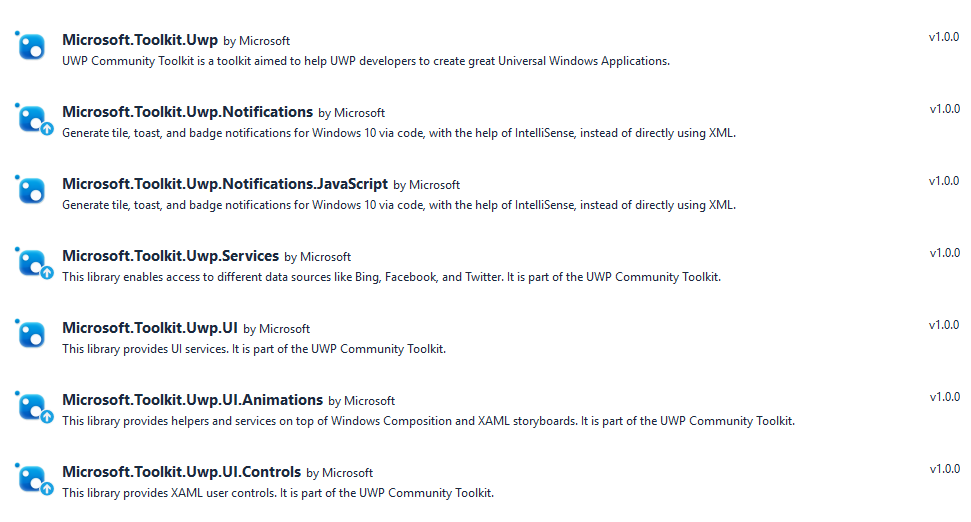

UWP Community Toolkit
===========

The UWP Community Toolkit is a collection of helper functions, custom controls, and app services. It simplifies and demonstrates common developer tasks building UWP apps for Windows 10.

## Build status

| Target | Branch | Status | Recommended Nuget packages version |
| ------ | ------ | ------ | ------ |
| Production | master |  | 1.1 |
| Pre-release beta testing | dev |  | Use our [pre-release Nuget repo](https://ci.appveyor.com/nuget/uwpcommunitytoolkit-dev) |

## Getting started

Please read the [getting Started with the UWP Toolkit](http://uwpcommunitytoolkit.readthedocs.io/en/master/Getting-Started/) page for more detailed information about using the toolkit.

## UWP Community Toolkit Sample App

Want to see the toolkit in action before jumping into the code?  Download and play with the [UWP Toolkit Sample App](https://www.microsoft.com/store/apps/9nblggh4tlcq) from the Store.

## Nuget Packages

NuGet is a standard package manager for .NET applications that is built into Visual Studio. From your open solution choose the *Tools* menu, *NuGet Package Manager*, *Manage NuGet packages for solution...* to open the UI.  Enter one of the package names below to search for it online.

Once you search you should see a list similar to the one below (versions may be different, but names should be the same).

| NuGet Package Name | description |
| --- | --- |
| Microsoft.Toolkit.Uwp | Main NuGet package includes code only helpers such as Colors conversion tool, Internet Connection detection, Storage file handling, a Stream helper class, etc. |
| Microsoft.Toolkit.Uwp.Notifications | Notifications Package - Generate tile, toast, and badge notifications for Windows 10 via code.  Includes IntelliSense support to avoid having to use the XML syntax. |
| Microsoft.Toolkit.Uwp.Notifications.Javascript | Notification Packages for JavaScript. |
| Microsoft.Toolkit.Uwp.Services | Services Package - This NuGet package includes the service helpers for Bing, Facebook, LinkedIn, Microsoft Graph and Twitter. |
| Microsoft.Toolkit.Uwp.UI | UI Packages - XAML converters, Visual tree extensions and helpers for your XAML UI. |
| Microsoft.Toolkit.Uwp.UI.Animations | Animations and Composition behaviors such as Blur, Fade, Rotate, etc. |
| Microsoft.Toolkit.Uwp.UI.Controls | XAML Controls such as RadialGauge, RangeSelector, etc. | 

## Features

### Animations

* [Blur](http://uwpcommunitytoolkit.readthedocs.io/en/master/animations/Blur/)
* [Offset](http://uwpcommunitytoolkit.readthedocs.io/en/master/animations/Offset/)
* [Fade](http://uwpcommunitytoolkit.readthedocs.io/en/master/animations/Fade/)
* [Rotate](http://uwpcommunitytoolkit.readthedocs.io/en/master/animations/Rotate/)
* [Scale](http://uwpcommunitytoolkit.readthedocs.io/en/master/animations/Scale/)
* [FadeHeader](http://uwpcommunitytoolkit.readthedocs.io/en/master/animations/FadeHeader/)

### Controls

* [AdaptiveGridView](http://uwpcommunitytoolkit.readthedocs.io/en/master/controls/AdaptiveGridView/)
* [BladeControl](http://uwpcommunitytoolkit.readthedocs.io/en/master/controls/BladeControl/)
* [DropShadowPanel](http://uwpcommunitytoolkit.readthedocs.io/en/master/controls/DropShadowPanel/)
* [GridSplitter](http://uwpcommunitytoolkit.readthedocs.io/en/master/controls/GridSplitter/)
* [HamburgerMenu](http://uwpcommunitytoolkit.readthedocs.io/en/master/controls/HamburgerMenu/)
* [HeaderedTextBlock](http://uwpcommunitytoolkit.readthedocs.io/en/master/controls/HeaderedTextBlock/)
* [ImageEx](http://uwpcommunitytoolkit.readthedocs.io/en/master/controls/ImageEx/)
* [PullToRefreshListView](http://uwpcommunitytoolkit.readthedocs.io/en/master/controls/PullToRefreshListview/)
* [RadialGauge](http://uwpcommunitytoolkit.readthedocs.io/en/master/controls/RadialGauge/)
* [RangeSelector](http://uwpcommunitytoolkit.readthedocs.io/en/master/controls/RangeSelector/)
* [RotatorTile](http://uwpcommunitytoolkit.readthedocs.io/en/master/controls/RotatorTile/)
* [SlideableListItem](http://uwpcommunitytoolkit.readthedocs.io/en/master/controls/SlidableListItem/)

### Code Helpers

* [Colors](http://uwpcommunitytoolkit.readthedocs.io/en/master/helpers/Colors/)
* [Connection](http://uwpcommunitytoolkit.readthedocs.io/en/master/helpers/ConnectionHelper/)
* [Converters](http://uwpcommunitytoolkit.readthedocs.io/en/master/helpers/Converters/)
* [ImageCache](http://uwpcommunitytoolkit.readthedocs.io/en/master/helpers/ImageCache/)
* [Incremental Loading Collection](http://uwpcommunitytoolkit.readthedocs.io/en/master/helpers/IncrementalLoadingCollection/)
* [Object Storage](http://uwpcommunitytoolkit.readthedocs.io/en/master/helpers/ObjectStorageHelper/)
* [StorageFiles](http://uwpcommunitytoolkit.readthedocs.io/en/master/helpers/StorageFiles/)
* [Streams](http://uwpcommunitytoolkit.readthedocs.io/en/master/helpers/Streams/)
* [VisualTreeExtensions](http://uwpcommunitytoolkit.readthedocs.io/en/master/helpers/VisualTreeExtensions/)
* [WeakEventListener](http://uwpcommunitytoolkit.readthedocs.io/en/master/helpers/WeakEventListener/)

### Services

* [Bing](http://uwpcommunitytoolkit.readthedocs.io/en/master/services/Bing/)
* [Facebook](http://uwpcommunitytoolkit.readthedocs.io/en/master/services/Facebook/)
* [LinkedIn](http://uwpcommunitytoolkit.readthedocs.io/en/master/services/LinkedId/)
* [Microsoft Graph](http://uwpcommunitytoolkit.readthedocs.io/en/master/services/MicrosoftGraph/)
* [Twitter](http://uwpcommunitytoolkit.readthedocs.io/en/master/services/Twitter/)

### Notifications
- [Tiles](https://blogs.msdn.microsoft.com/tiles_and_toasts/2015/06/30/adaptive-tile-templates-schema-and-documentation/)
- [Toasts](https://blogs.msdn.microsoft.com/tiles_and_toasts/2015/07/02/adaptive-and-interactive-toast-notifications-for-windows-10/)

## Feedback and Requests

Please use [GitHub issues](https://github.com/Microsoft/UWPCommunityToolkit/issues) for questions or comments.

If you have specific feature requests or would like to vote on what others are recommending visit our [UWP Community Toolkit User Voice](https://aka.ms/uwpcommunitytoolkituservoice).

## Contributing
Do you want to contribute? Here are our [contribution guidelines](https://github.com/Microsoft/UWPCommunityToolkit/blob/master/contributing.md).

## Principles

 - Principle #1: The toolkit will be kept simple.
 - Principle #2: As soon as a comparable feature is available in the Windows SDK for Windows 10, it will be marked as deprecated.
 - Principle #3: All features will be supported for two Windows SDK for Windows 10 release cycles or until another principle supersedes it.

This project has adopted the [Microsoft Open Source Code of Conduct](https://opensource.microsoft.com/codeofconduct/). For more information see the [Code of Conduct FAQ](https://opensource.microsoft.com/codeofconduct/faq/) or contact [opencode@microsoft.com](mailto:opencode@microsoft.com) with any additional questions or comments.

## Roadmap

Read what we [plan for next iteration](https://github.com/Microsoft/UWPCommunityToolkit/issues?q=is%3Aopen+is%3Aissue+milestone%3Av1.2), and feel free to ask questions.

By adding this [Nuget repo](https://ci.appveyor.com/nuget/uwpcommunitytoolkit-dev) to your Visual Studio, you can also get pre-release packages of upcoming version (updated on every pull request).
